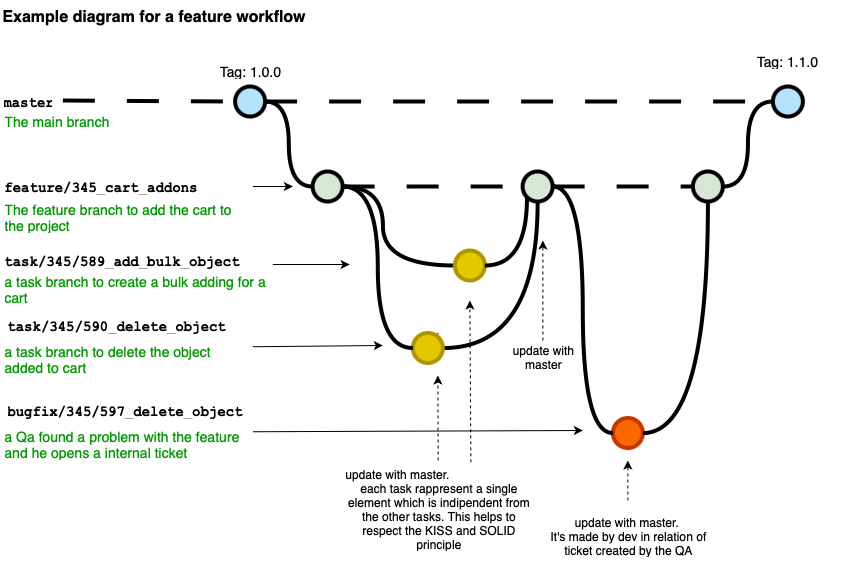
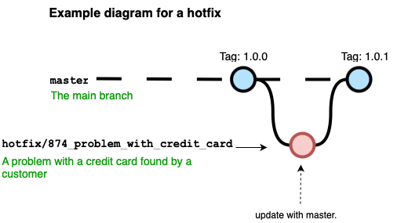
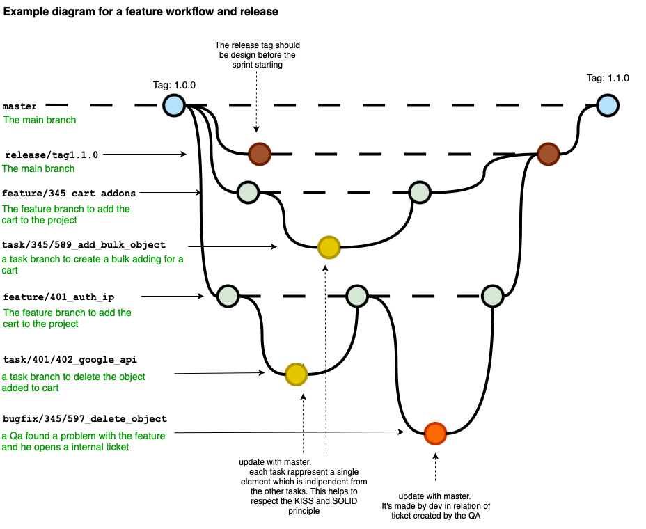

# AgileFlow - A Git Branching Strategy for Agile Teams

Modern Agile teams often struggle to find the right balance between flexibility and structure in their Git workflows. While GitFlow introduces too much overhead for fast-paced iterations, Trunk-Based Development often lacks the traceability and coordination needed by QA and product teams.

**AgileFlow** provides a lightweight but structured alternative. It defines clear rules for task breakdown, branch naming, version tagging, and automated release notes — perfectly aligned with Agile delivery models.

## Branch Structure

AgileFlow defines a clear and modular branch structure designed to support Agile workflows with short-lived, traceable, and purpose-specific branches. Each branch type has a distinct and well-defined role in the development lifecycle. This structured approach ensures clarity for the team, facilitates automation, and enables traceability from code to business requirements.

### Branch Types

| Branch Type | Purpose |
| ----------- | ------- |
| `master` | This is the main branch representing production-ready code. It always reflects the latest stable version of the application and is tagged accordingly. |
| `feature/` | Represents a new functionality or Epic. It is a parent branch that groups several `task/` branches related to the same business objective. |
| `task/` | A small, focused unit of development work (maximum 8 hours) implementing a single method or business logic. Tied to a specific ticket or user story. |
| `bugfix/` | Branches created when QA identifies an issue during feature testing. They are merged back into their respective `feature/` branches. |
| `hotfix/` | Created directly from `master` to immediately address issues found in production. Typically triggers a patch version bump. |
| `release/` | Temporary branches used to prepare a new version. They aggregate tested `feature/` and `hotfix/` branches and serve as the final staging area before merging into `master`. |

## Merge Strategy

In AgileFlow, each branch type follows a precise merge process to ensure clarity, traceability, and consistency across all stages of development. Below is a breakdown of the three primary workflows, each illustrated with diagrams.

### 1. Feature Workflow

Every `feature/*` branch represents a functional unit of work and is composed of multiple small, atomic `task/*` branches. These tasks are limited to 8 hours of work and focus on specific business logic.



**Process:**
- A `feature/*` branch is created from `master`
- `task/*` branches are created from the feature branch
- Each `task/*` branch is merged into the feature branch upon completion
- If QA finds an issue during testing, a `bugfix/*` is created from the feature branch and merged back into it
- The feature branch is continuously updated with `master` to prevent drift
- Once stable, it is merged into a `release/*` branch

**Benefits:**
- Clear traceability between code and business requirements
- Modular commits allow easy code review and rollback
- Encourages adherence to KISS and SOLID principles

### 2. Hotfix Workflow

A `hotfix/*` is created directly from `master` to quickly resolve a production issue. This branch type is used exclusively for urgent fixes that must bypass the regular sprint/release cadence.



**Process:**
- A critical bug is found in production
- A `hotfix/*` branch is created from `master`
- Code is updated and synced with `master`
- The fix is merged back into `master` and tagged with a new patch version
- If a `release/*` branch is in progress, the hotfix is also merged into it

**Benefits:**
- Fast response to customer-facing issues
- Minimal disruption to ongoing development
- Clear isolation of emergency fixes

### 3. Release Workflow

The `release/*` branch acts as a staging area for upcoming versions. It collects tested and verified `feature/*` and `hotfix/*` branches and allows QA to validate the full release before deployment.



**Process:**
- The team creates a `release/*` branch at the beginning of a sprint (optional but recommended)
- Features that are ready are merged into the release branch
- Hotfixes that are not urgent may also be added
- At the end of the sprint, the release is tested and merged into `master`
- A new version tag is created (usually minor or major)

**Benefits:**
- Aligns sprint planning with deployment
- Simplifies QA and UAT
- Reduces release-time surprises

### Merge Matrix

| From        | To          | When                                        | Version Impact         |
|-------------|-------------|---------------------------------------------|-------------------------|
| `task/*`    | `feature/*` | After task completion                      | None                    |
| `bugfix/*`  | `feature/*` | After QA finds and reports an issue        | None                    |
| `feature/*` | `release/*` | Once all tasks are complete and validated | MINOR bump              |
| `release/*` | `master`    | After sprint completion                    | MINOR or MAJOR bump     |
| `hotfix/*`  | `master`    | Immediately after fix is tested            | PATCH bump              |
| `hotfix/*`  | `release/*` | If a release branch is open                | PATCH bump (duplicated) |

## Commit Convention

AgileFlow uses structured commit messages to improve readability, traceability, and automation. By adopting the Conventional Commits standard, teams can better understand the purpose of each change, automate changelogs, and link commits to specific tasks and scopes.

```bash
type(scope): message
```

Examples:

```bash
feat(checkout): add billing step
fix(auth): resolve login crash
refactor(cart): extract calculator method
```

## Release Notes Automation

Automated release notes are one of AgileFlow's most valuable features. By adhering to naming conventions and structured commits, teams can generate clear and human-readable changelogs without manual effort.  
The CI pipeline collects metadata from merged branches and commits to build categorized release notes. These notes can be published in CHANGELOG.md, used for GitHub/GitLab releases, or integrated into dashboards.

**Key benefits:**

- Fully automated from developer input (no extra work)
- Includes ticket IDs, titles, and scope of change
- Categorizes changes into Features, Fixes, Refactors, etc.
- Helps QA and PMs track progress and impact

**Supported sources:**

- Branch names following feature/, task/, bugfix/, hotfix/, and release/ naming patterns
- Conventional commit messages with clear scope
- Merge patterns into release/* or directly into master

### Example Release Note

```
Version 1.4.0 (2025-08-05)
-----------------------------
Features
- [12345] Checkout flow improvements
- [12346] Shipping calculation

Fixes
- [12350] Login crash on session timeout

Refactors
- [12347] Simplified cart logic
```

## Versioning Strategy (SemVer)

AgileFlow follows Semantic Versioning to maintain clarity and predictability in version changes. Every merge into master triggers a pipeline that evaluates the nature of the change based on:
- The type of branch merged (feature, hotfix, release)
- The presence of BREAKING CHANGE: in commit messages

### Rules

| Change Type         | Branch Trigger         | Resulting Version Bump |
|---------------------|------------------------|-------------------------|
| Breaking API Change | Any (with annotation)  | MAJOR ↑                |
| New Functionality   | `feature/`, `release/` | MINOR ↑                |
| Bugfix              | `hotfix/`              | PATCH ↑                |

### Example

- Merging feature/1001_checkout → master → 1.2.0  
- Merging hotfix/3456_login_error → master → 1.2.1  
- Merging with BREAKING CHANGE: in commit → 2.0.0  

All tags are automatically created using GitHub Actions.

## How This Enables Agile Teams

AgileFlow was designed to remove friction between developers, QA, and product managers. It brings together clarity (via structured branch names), traceability (via conventional commits), and automation (via CI workflows).  
By structuring branches around actual deliverables (tasks, features, fixes), it aligns better with Agile rituals such as sprint planning, grooming, QA testing, and demos.

**Benefits include:**

- Smaller PRs and faster reviews  
- Clear visibility of what gets released  
- Precise targeting of what to test  
- Easy rollback via task-based history

## Tooling & Compatibility

AgileFlow works with:

- GitHub / GitLab
- GitHub Actions / GitLab CI
- Jira, TargetProcess, Linear, etc.
- Conventional Commits
- Release Drafter, semantic-release, changelog generators

Optionally, it can be extended with:

- Git hooks to enforce naming patterns
- Monorepo support via folder-based scoping
- GitHub PR templates auto-filled from branch names
