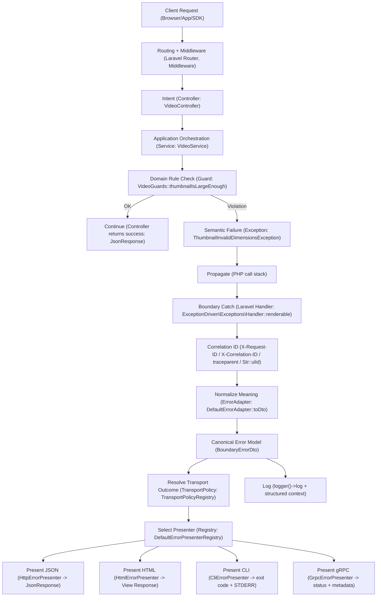

# Exception-Driven Application Flow in Laravel

In a previous company I hit the classic scaling problem: **every developer interpreted error handling their own way**.

* some controllers returned `success=false` with `200`
* others threw exceptions
* others mixed status codes, payload schemas, and logging rules inline

The result was predictable:

* inconsistent API contracts
* duplicated mappings scattered across the codebase
* painful incident response (no universal correlation)
* hard to add new channels (CLI, HTML, gRPC) without rewriting error logic

So the goal became simple and non-negotiable:

* **one stable semantic contract** (`response_code`)
* **one boundary-owned translation layer** (policy + presentation)
* **one universal model** that works across transports



## Overview

* **Audience:** senior backend devs, tech leads, software architects (Laravel, PHP >= 8.1).
* **Problem:** error-handling becomes inconsistent when controllers/services mix *meaning* with *policy* (status codes, payload shapes, logging, messages).
* **Goal:** one consistent boundary that translates errors for **HTTP/CLI/gRPC**.
* **Non-goals:**

  * replace framework docs
  * enforce DDD on/off
  * prescribe observability stacks (ELK/OTEL)

### Core idea

* **Domain throws meaning** (typed semantic exceptions).
* **Boundary applies policy** (payload schema, logging, i18n, and transport mapping).
* **Mappings are owned by domain modules via policy providers (Transport Policy Registry)**, so mappings scale without a gigantic lookup table and remain transport-agnostic.
* **Clients rely on `response_code`** (stable contract), not on message text.

### Example

**Anti-pattern: policy leaks everywhere (arrays / ad-hoc payloads).**

```php
<?php
// "Return arrays" style: policy leaks everywhere.
public function uploadThumbnail(Request $request): JsonResponse
{
    $width = (int) $request->input('width');
    $height = (int) $request->input('height');

    // Domain meaning: thumbnail is too small.
    // Policy decisions (problematic here): HTTP status, payload schema, logging, and message text.
    if ($width < 640 || $height < 360) {
        logger()->info('Thumbnail too small', ['width' => $width, 'height' => $height]);

        return response()->json([
            'success' => false,
            'error' => [
                // Some controllers use response_code, others don't. Some nest meta, others flatten it.
                'response_code' => 'THUMBNAIL_TOO_SMALL',
                'message' => 'Thumbnail too small',
                'meta' => ['width' => $width, 'height' => $height],
            ],
        ], 422);
    }

    // ... more checks, more duplicated mapping rules, more payload variations ...

    return response()->json(['success' => true]);
}
```

**Preferred: controller expresses intent; domain throws semantics; boundary translates.**

```php
<?php
// "Throw meaning" style: domain/validation expresses semantics only.
public function uploadThumbnail(Request $request): JsonResponse
{
    $width = (int) $request->input('width');
    $height = (int) $request->input('height');

    VideoGuards::thumbnailIsLargeEnough($width, $height);

    return response()->json(['success' => true]);
}
```

### Contract

An implementation conforming to this document:

* MUST model abnormal states as **semantic exceptions** (not boolean returns or ad-hoc arrays)

* MUST expose a stable, machine-readable **response_code** as the primary client contract

* MUST keep transport policy (HTTP status, exit codes, gRPC status, messages, logging strategy) **out of domain code**

* MUST normalize any `Throwable` into a canonical **Boundary Error DTO** via an ErrorAdapter

* MUST present errors through a consistent transport payload/schema (HTTP/CLI/gRPC)

* SHOULD translate human-facing messages only at the boundary (i18n), never in domain logic

* MUST test contracts by asserting `response_code` + transport outcome (status/exit/grpc), not translated messages

* `response_code` is the primary machine contract; `log_level` is a secondary semantic classification

* **Guiding principle:** *the domain throws meaning; the boundary translates meaning*.

---

## Core Principles (Non-Negotiable)

### Exception ≠ Control Flow

Exceptions represent **abnormal states or boundary outcomes**, not alternative execution paths. They must never replace conditional branching or be used for normal flow control.

**Wrong (exceptions as goto):**

```php
<?php
public function handle(Request $request): JsonResponse
{
    try {
        $user = $this->auth->requireUser($request);
        $this->service->doWork($user);
    } catch (Throwable $e) {
        // “Anything bad => 200 with success=false” or “just swallow and continue”.
        return response()->json(['success' => false]);
    }

    // Execution continues with unknown state.
    return response()->json(['success' => true]);
}
```

**Correct (exceptions for abnormal outcomes, handled at the boundary):**

```php
<?php
public function handle(Request $request): JsonResponse
{
    $user = $this->auth->requireUser($request); // may throw NotAuthenticated/NotAuthorized

    $this->service->doWork($user);              // may throw semantic domain exceptions

    return response()->json(['success' => true]);
}
```

Valid uses include authorization failures, invalid input, invariant violations, and impossible states. If the caller can continue execution meaningfully, an exception is the wrong tool.

### Assertion ≠ Business Decision

Assertions protect **domain invariants** and fail fast. They must never encode reversible business decisions or optional paths.

Put differently: assertions are for “this must never be false in a valid system state”, not for policy rules like “if risk_score > X then require extra verification” (that’s a business policy path, not an invariant).

### Boundary Owns Policy

The domain does not decide:

* payload schema
* client message text / translations
* logging strategy

**Transport mapping is applied at the boundary**, but you should avoid a giant per-error lookup table.

Instead, each domain exposes a small provider that the boundary composes via a registry.

* domain: owns its own error enum and a provider that maps codes to outcomes
* boundary: composes providers in a registry; no global mapping table

This keeps the exception-driven engine **agnostic**, the mapping **modular**, and the table **small and stable**.

> If your domain hardcodes HTTP numbers everywhere, you reintroduce coupling and you’ll regret it when you add CLI/gRPC or change policy.

Semantic severity vs logging strategy
`log_level` is a semantic severity hint attached to the error meaning (PSR-3 level). It classifies how expected/critical the failure is. The boundary may use it for logging and may expose it to clients, but transport-specific decisions remain boundary-owned.

### Stable Contracts > Messages

Messages are for humans and change over time. Contracts are for machines and must remain stable. Clients must rely on contracts, not on messages.

---

## Exception-Driven Flow

The conceptual flow is:

1. The domain evaluates a rule
2. A rule violation produces a semantic failure
3. The failure is expressed as a typed exception
4. The exception propagates to the boundary
5. The boundary normalizes meaning, applies policy, and produces output

No intermediate handling is allowed unless explicit recovery is possible.

---

## `response_code` as Business Contract

Exceptions MUST propagate unchanged until the boundary. Intermediate try/catch is forbidden unless performing explicit recovery. The boundary is responsible for normalization, enrichment, and presentation.

Rules:

* stable over time
* unique within its domain
* language-independent
* not derived from messages
* independent from transport
* “MUST NOT reuse a response_code for a different meaning”
* “Changing text/translation MUST NOT change response_code”

HTTP status codes are too coarse and contextual to represent business meaning.

---

## ErrorCode Design (Domain-Scoped Enums)

A single global error enum does not scale. Each domain owns its own error codes.

The core idea is:

* each domain defines its own enum (VideoErrorCode, UserErrorCode, BillingErrorCode, ...)
* all enums implement a shared interface (`ErrorCodeInterface`)
* each domain provides a small policy provider that returns a transport outcome for its codes

This gives you:

* a complete, local list of domain errors (inside `Domain/Video`)
* no gigantic global mapping table (the registry composes small per-domain providers)
* the engine stays transport-agnostic

Additionally, keep a small Platform fallback enum for unknown throwables (e.g. `INTERNAL_SERVER_ERROR`).

### Interface

```php
<?php
declare(strict_types=1);

namespace ExceptionDriven\ErrorHandling;

interface ErrorCodeInterface
{
    /** Stable business identifier (API contract). */
    public function responseCode(): string;

    /** Translation key used by the boundary. */
    public function translationKey(): string;
}
```

### Example: Video domain enum

```php
<?php
declare(strict_types=1);

namespace ExceptionDriven\Domain\Video;

use ExceptionDriven\ErrorHandling\ErrorCodeInterface;

enum VideoErrorCode: string implements ErrorCodeInterface
{
    case THUMBNAIL_INVALID_DIMENSIONS = 'VIDEO_THUMBNAIL_INVALID_DIMENSIONS';
    case VIDEO_NOT_FOUND = 'VIDEO_NOT_FOUND';

    public function responseCode(): string
    {
        return $this->value;
    }

    public function translationKey(): string
    {
        return match ($this) {
            self::THUMBNAIL_INVALID_DIMENSIONS => 'errors.video.thumbnail_invalid_dimensions',
            self::VIDEO_NOT_FOUND => 'errors.video.not_found',
        };
    }

    // no transport policy concerns here

}
```

### Platform fallback enum

This enum (Platform domain) is used by the ErrorAdapter when an unknown `Throwable` needs to be mapped into a stable contract.

```php
<?php
declare(strict_types=1);

// ErrorPolicyKey removed: mappings are provided by per-domain providers composed in a registry
```

```php
<?php
declare(strict_types=1);

namespace ExceptionDriven\ErrorHandling;

use ExceptionDriven\ErrorHandling\ErrorCodeInterface;

enum PlatformErrorCode: string implements ErrorCodeInterface
{
    case INTERNAL_SERVER_ERROR = 'INTERNAL_SERVER_ERROR';

    public function responseCode(): string { return $this->value; }

    public function translationKey(): string
    {
        return 'errors.platform.internal_server_error';
    }

    // no transport policy concerns here
}
```

Notes:

* Keeping transport mappings in a single application-level policy map prevents duplicated mapping tables scattered in handlers/presenters.
* `translationKey()` is stable; the translated text is not

---

## Semantic Exceptions Contract (Interface + Base)

* **Goal:** let the boundary treat all semantic failures the same way.
* The boundary depends on **`ApiExceptionInterface`** (not on a concrete base class).
* **`ApiException`** is a convenience base; the interface is the real contract.

```php
<?php
declare(strict_types=1);

namespace ExceptionDriven\Exceptions;

use ExceptionDriven\ErrorHandling\ErrorCodeInterface;
use Throwable;

interface ApiExceptionInterface extends Throwable
{
    public function codeEnum(): ErrorCodeInterface;

    /** PSR-3 severity hint (e.g. LogLevel::INFO). */
    public function logLevel(): string;

    /** @return array<string,mixed> */
    public function messageParams(): array;

    /** @return array<string,mixed> Internal-only log context */
    public function context(): array;

    /** @return array<string,mixed> Client-safe metadata */
    public function publicMeta(): array;
}
```

```php
<?php
declare(strict_types=1);

namespace ExceptionDriven\Exceptions;

use Exception;
use ExceptionDriven\ErrorHandling\ErrorCodeInterface;
use Psr\Log\LogLevel;

abstract class ApiException extends Exception implements ApiExceptionInterface
{
    /** Each semantic exception maps to a domain-owned error code. */
    abstract public static function code(): ErrorCodeInterface;

    public const LOG_LEVEL = LogLevel::ERROR;

    final public function codeEnum(): ErrorCodeInterface
    {
        return static::code();
    }

    final public function logLevel(): string
    {
        return static::LOG_LEVEL;
    }

    public function messageParams(): array { return []; }

    public function context(): array { return []; }

    public function publicMeta(): array { return []; }
}
```

---

## Domain Exceptions (Examples)

Domain exceptions represent specific, semantic failure cases. Each exception class must be precise, explicit, and owned by the domain that defines the rule.

### Validation-like example

```php
<?php
declare(strict_types=1);

namespace ExceptionDriven\Domain\Video\Exceptions;

use ExceptionDriven\Exceptions\ApiException;
use ExceptionDriven\ErrorHandling\ErrorCodeInterface;
use ExceptionDriven\Domain\Video\VideoErrorCode;
use Psr\Log\LogLevel;

final class ThumbnailInvalidDimensionsException extends ApiException
{
    public const LOG_LEVEL = LogLevel::INFO;

    public function __construct(
        private int $width,
        private int $height
    ) {
        parent::__construct('Invalid thumbnail dimensions');
    }

    public static function code(): ErrorCodeInterface
    {
        return VideoErrorCode::THUMBNAIL_INVALID_DIMENSIONS;
    }

    public function publicMeta(): array
    {
        return ['width' => $this->width, 'height' => $this->height];
    }
}
```

These exceptions encode meaning only; no transport logic is present.

---

## Guards & Assertions

Guards and assertions protect domain invariants and remove defensive branching from core logic. They fail fast by throwing semantic exceptions and never attempt recovery.

They also cover validation-like rules when they are boundary constraints: preconditions at module boundaries (e.g., controller → domain), data shape/format checks, or contract constraints that must hold for the domain to proceed. They are not business policy branches nor reversible decisions.

```php
<?php
declare(strict_types=1);

namespace ExceptionDriven\Domain\Video;

use ExceptionDriven\Domain\Video\Exceptions\ThumbnailInvalidDimensionsException;

final class VideoGuards
{
    public static function thumbnailIsLargeEnough(int $width, int $height): void
    {
        if ($width < 640 || $height < 360) {
            throw new ThumbnailInvalidDimensionsException($width, $height);
        }
    }
}
```

Assertions make invariants explicit, self-documenting, and trivially testable.

---

## Boundary Error DTO

The Boundary Error DTO is the internal, canonical representation of an error. All transports operate from this model.

It contains:

* the semantic error code (business contract)
* a `message_key` (translation key)
* optional `message_params` (translation placeholders)
* the severity level (PSR-3)
* public metadata (safe for clients)
* structured logging context (internal-only)
* a `correlation_id` (ULID/UUID) chosen from `X-Request-ID`/`X-Correlation-ID`/`traceparent` if present, otherwise generated at the boundary

This guarantees a single source of truth for error handling.

### Reference implementation

```php
<?php
declare(strict_types=1);

namespace ExceptionDriven\ErrorHandling;

final class BoundaryErrorDto
{
    /**
     * @param array<string,mixed> $messageParams
     * @param array<string,mixed> $meta
     * @param array<string,mixed> $logContext
     */
    public function __construct(
        public readonly ErrorCodeInterface $code,
        public readonly string $messageKey,
        public readonly array $messageParams,
        public readonly string $logLevel,
        public readonly array $meta = [],
        public readonly array $logContext = [],
        public readonly string $correlationId = '',
        public readonly string $category = 'internal',
        public readonly bool $retryable = false,
        public readonly bool $isExpected = false,
    ) {}

    public function responseCode(): string
    {
        return $this->code->responseCode();
    }

    /**
     * Prepare structured context for logging.
     * Tip: adapt this structure to your observability stack (PSR-3 context, OTEL attributes, etc.).
     * Keep it stable and machine-readable; avoid PII.
     *
     * @return array<string,mixed>
     */
    public function toArray(): array
    {
        return [
            'response_code' => $this->responseCode(),
            'log_level' => $this->logLevel,
            'message_key' => $this->messageKey,
            'message_params' => $this->messageParams,
            'meta' => $this->meta,
            'correlation_id' => $this->correlationId,
            'category' => $this->category,
            'retryable' => $this->retryable,
            'is_expected' => $this->isExpected,
            'context' => $this->logContext,
        ];
    }
}
```

### Notes

* `meta` must contain only client-safe information (no stack traces, no SQL, no internal identifiers unless explicitly allowed).
* `logContext` is meant for structured logs and debugging. Keep it stable and machine-readable.
* `message_key` and `message_params` should come from the semantic error (exception/code). The final human message is resolved by the presenter at the boundary (not from the exception message).
* `log_level` is semantic (part of the error meaning), not transport policy. It is stable enough to be used by client UI/telemetry, but it must not replace `response_code` as the primary contract. Clients MAY use it for UI hints; MUST rely on `response_code` for logic.

---

## ErrorAdapter

The ErrorAdapter converts any `Throwable` into a `BoundaryErrorDto`.

Responsibilities:

* read `ErrorCodeInterface` + log level + metadata from semantic exceptions
* map unknown throwables to PlatformErrorCode::INTERNAL_SERVER_ERROR and enrich log context for diagnostics
* collect structured logging context

Unknown exceptions are treated as `INTERNAL_SERVER_ERROR` by default.

### Adapter interface

```php
<?php
declare(strict_types=1);

namespace ExceptionDriven\ErrorHandling;

use Throwable;

interface ErrorAdapterInterface
{
    public function toDto(Throwable $e, string $correlationId): BoundaryErrorDto;
}
```

### Semantic exceptions contract

The adapter must not depend on a specific base class. Any exception can participate as long as it implements `ApiExceptionInterface` (defined earlier).

### Fallback mapping (no extra exception class)

When the application hits an unknown `Throwable` (vendor bug, runtime error, `TypeError`, etc.), the adapter maps it directly to a stable fallback code (e.g. `INTERNAL_SERVER_ERROR`) and enriches the log context for diagnostics.

The transport policy map MUST define default mappings for `PlatformErrorCode::INTERNAL_SERVER_ERROR` (HTTP 500, CLI 1, gRPC INTERNAL).
If a code is not explicitly mapped, the policy MUST fall back to the Platform default mapping.

### Default adapter (reference implementation)

The adapter does not translate messages. It only produces a canonical DTO with a translation key + params.

```php
<?php
declare(strict_types=1);

namespace ExceptionDriven\ErrorHandling;

use ExceptionDriven\Exceptions\ApiExceptionInterface;
use Psr\Log\LogLevel;
use Throwable;

final class DefaultErrorAdapter implements ErrorAdapterInterface
{
    public function toDto(Throwable $e, string $correlationId): BoundaryErrorDto
    {
        if ($e instanceof ApiExceptionInterface) {
            $code = $e->codeEnum();

            return new BoundaryErrorDto(
                code: $code,
                messageKey: $code->translationKey(),
                messageParams: $e->messageParams(),
                logLevel: $e->logLevel(),
                meta: $e->publicMeta(),
                logContext: $e->context(),
                correlationId: $correlationId,
            );
        }

        $code = PlatformErrorCode::INTERNAL_SERVER_ERROR;

        return new BoundaryErrorDto(
            code: $code,
            messageKey: $code->translationKey(),
            messageParams: [],
            logLevel: LogLevel::ERROR,
            meta: [],
            logContext: [
                'exception_class' => get_class($e),
                'exception_code' => $e->getCode(),
                'exception_file' => $e->getFile(),
                'exception_line' => $e->getLine(),
                'exception_fingerprint' => sprintf('%s@%s:%d', get_class($e), $e->getFile(), $e->getLine()),
            ],
            correlationId: $correlationId,
        );
    }
}
```

---

## Transport Policy Registry (Scalable, Domain-Owned)

The goal is to avoid two extremes:

* a single **global mapping table** (becomes a dumping ground)
* transport numbers embedded inside domain enums/exceptions (couples domain to HTTP/CLI/gRPC)

Instead, keep mappings **owned by each domain module** via small providers, and compose them at the boundary through a registry.

### Core idea

* Each bounded context/domain module exposes a **policy provider** for its own error codes.
* The boundary composes providers through a registry.
* If no provider matches, fall back to a Platform default (deterministic behavior).

### TransportOutcome DTO

```php
<?php
declare(strict_types=1);

namespace ExceptionDriven\Policy;

final class TransportOutcome
{
    public function __construct(
        public readonly int $httpStatus,
        public readonly int $cliExitCode,
        public readonly GrpcStatus $grpcStatus,
    ) {}
}
```

### Provider interface

```php
<?php
declare(strict_types=1);

namespace ExceptionDriven\Policy;

use ExceptionDriven\ErrorHandling\ErrorCodeInterface;

interface TransportPolicyProviderInterface
{
    /** Whether this provider owns/matches the given code (usually by enum class). */
    public function supports(ErrorCodeInterface $code): bool;

    /** Resolve transport outcomes for a code owned by this provider. */
    public function outcome(ErrorCodeInterface $code): TransportOutcome;
}
```

### Registry (boundary composition)

```php
<?php
declare(strict_types=1);

namespace ExceptionDriven\Policy;

use ExceptionDriven\ErrorHandling\ErrorCodeInterface;

interface TransportPolicyInterface
{
    public function outcome(ErrorCodeInterface $code): TransportOutcome;
}

final class TransportPolicyRegistry implements TransportPolicyInterface
{
    /** @param list<TransportPolicyProviderInterface> $providers */
    public function __construct(
        private readonly array $providers,
        private readonly TransportPolicyProviderInterface $fallback,
    ) {}

    public function outcome(ErrorCodeInterface $code): TransportOutcome
    {
        foreach ($this->providers as $provider) {
            if ($provider->supports($code)) {
                return $provider->outcome($code);
            }
        }

        return $this->fallback->outcome($code);
    }
}
```

### Example: Video domain provider (lives near Domain/Video)

Note: import Symfony HTTP constants with `use Symfony\Component\HttpFoundation\Response;`.

```php
<?php
declare(strict_types=1);

namespace ExceptionDriven\Domain\Video\Policy;

use ExceptionDriven\Domain\Video\VideoErrorCode;
use ExceptionDriven\ErrorHandling\ErrorCodeInterface;
use ExceptionDriven\Policy\TransportOutcome;
use ExceptionDriven\Policy\TransportPolicyProviderInterface;

use Symfony\Component\HttpFoundation\Response;
use ExceptionDriven\Policy\GrpcStatus;

final class VideoTransportPolicyProvider implements TransportPolicyProviderInterface
{
    public function supports(ErrorCodeInterface $code): bool
    {
        return $code instanceof VideoErrorCode;
    }

    public function outcome(ErrorCodeInterface $code): TransportOutcome
    {
        /** @var VideoErrorCode $code */
        return match ($code) {
            VideoErrorCode::THUMBNAIL_INVALID_DIMENSIONS => new TransportOutcome(Response::HTTP_UNPROCESSABLE_ENTITY, 1, GrpcStatus::INVALID_ARGUMENT),
            VideoErrorCode::VIDEO_NOT_FOUND => new TransportOutcome(Response::HTTP_NOT_FOUND, 1, GrpcStatus::NOT_FOUND),
        };
    }
}
```

### Platform fallback provider (default)

Note: import Symfony HTTP constants with `use Symfony\Component\HttpFoundation\Response;`.

```php
<?php
declare(strict_types=1);

namespace ExceptionDriven\Policy;

use ExceptionDriven\ErrorHandling\ErrorCodeInterface;
use ExceptionDriven\ErrorHandling\PlatformErrorCode;
use ExceptionDriven\Policy\GrpcStatus;

use Symfony\Component\HttpFoundation\Response;

final class PlatformTransportPolicyProvider implements TransportPolicyProviderInterface
{
    public function supports(ErrorCodeInterface $code): bool
    {
        return $code instanceof PlatformErrorCode;
    }

    public function outcome(ErrorCodeInterface $code): TransportOutcome
    {
        // INTERNAL fallback
        return new TransportOutcome(Response::HTTP_INTERNAL_SERVER_ERROR, 1, GrpcStatus::INTERNAL);
    }
}
```

### Presenter usage

Presenters should resolve outcomes once and then pick the transport-specific value:

```php
$outcome = app(TransportPolicyInterface::class)->outcome($dto->code);
$status = $outcome->httpStatus;
```

This scales because:

* no global enum grows with the organization
* each domain owns its mapping (in the same module/folder as its error codes)
* the engine remains agnostic

---

## Presenters

Presenters adapt a `BoundaryErrorDto` to a specific transport and format. They use an application-level Transport Policy Registry to resolve transport-specific details (HTTP status, CLI exit code, gRPC status).

They:

* format output (JSON, console text, gRPC error)
* apply transport mappings (HTTP status, exit code, gRPC status)

They never:

* decide error meaning
* create response codes
* contain business logic

### Presenter interface

Define a common interface implemented by all presenters. Implementations may return different types (HTTP Response, CLI exit code, gRPC metadata), so the method is polymorphic.

```php
<?php
declare(strict_types=1);

namespace ExceptionDriven\Presentation;

use ExceptionDriven\ErrorHandling\BoundaryErrorDto as ErrorDto;

interface ErrorPresenterInterface
{
    /**
     * Present the error to the current transport.
     *
     * @return mixed Response|int|array depending on transport
     */
    public function present(ErrorDto $dto): mixed;
}
```

### Presenter registry (by transport)

To make new channels plug-and-play (HTTP, HTML, CLI, gRPC, …), use a transport enum and a centralized presenter registry.

```php
<?php
declare(strict_types=1);

namespace ExceptionDriven\Presentation;

use Illuminate\Http\Request;

enum Transport: string
{
    case HTTP_JSON = 'http_json';
    case HTTP_HTML = 'http_html';
    case CLI = 'cli';
    case GRPC = 'grpc';
}

interface ErrorPresenterRegistryInterface
{
    public function resolveForHttp(Request $request): ErrorPresenterInterface;
    public function get(Transport $transport): ErrorPresenterInterface;
}

final class DefaultErrorPresenterRegistry implements ErrorPresenterRegistryInterface
{
    public function __construct(
        private readonly HttpErrorPresenter $http,
        private readonly HtmlErrorPresenter $html,
        private readonly CliErrorPresenter $cli,
        private readonly GrpcErrorPresenter $grpc,
    ) {}

    public function resolveForHttp(Request $request): ErrorPresenterInterface
    {
        $accept = (string) $request->headers->get('Accept', '');
        if (stripos($accept, 'application/json') !== false) { return $this->http; }
        if (stripos($accept, 'text/html') !== false) { return $this->html; }
        return $request->expectsJson() ? $this->http : $this->html;
    }

    public function get(Transport $transport): ErrorPresenterInterface
    {
        return match ($transport) {
            Transport::HTTP_JSON => $this->http,
            Transport::HTTP_HTML => $this->html,
            Transport::CLI => $this->cli,
            Transport::GRPC => $this->grpc,
        };
    }
}
```

### HTTP presenter

**HTTP presenter**

```php
<?php
declare(strict_types=1);

namespace ExceptionDriven\Presentation;

use ExceptionDriven\ErrorHandling\BoundaryErrorDto as ErrorDto;
use ExceptionDriven\Policy\TransportPolicyInterface;
use Illuminate\Http\JsonResponse;
use Symfony\Component\HttpFoundation\Response;

final class HttpErrorPresenter implements ErrorPresenterInterface
{
    public function present(ErrorDto $dto): Response
    {
        // Translation is a boundary service (framework i18n), not domain logic.
        $message = __($dto->messageKey, $dto->messageParams);

        $meta = $dto->meta;
        $isList = array_keys($meta) === range(0, count($meta) - 1);
        $metaPayload = $isList ? ['data' => $meta] : $meta;

        $error = [
            'response_code' => $dto->responseCode(),
            'log_level' => $dto->logLevel,
            'message' => $message,
            'meta' => (object) $metaPayload,
            'correlation_id' => $dto->correlationId,
        ];

        return new JsonResponse([
            'success' => false,
            'error' => $error,
        ], app(TransportPolicyInterface::class)->outcome($dto->code)->httpStatus);
    }
}
```

### HTML/Blade presenter

If your route renders HTML with Blade instead of JSON, add a dedicated presenter that transforms the Boundary Error DTO into a view response. Use a presenter selection strategy to choose the presenter for the request.

```php
<?php
declare(strict_types=1);

namespace ExceptionDriven\Presentation;

use ExceptionDriven\ErrorHandling\BoundaryErrorDto as ErrorDto;
use ExceptionDriven\Policy\TransportPolicyInterface;
use Illuminate\Http\Response;

final class HtmlErrorPresenter implements ErrorPresenterInterface
{
    public function present(ErrorDto $dto): Response
    {
        // Translation is a boundary service (framework i18n), not domain logic.
        $message = __($dto->messageKey, $dto->messageParams);

        return response()->view('errors.generic', [
            'response_code' => $dto->responseCode(),
            'message' => $message,
            'meta' => $dto->meta,
            'correlation_id' => $dto->correlationId,
        ], app(TransportPolicyInterface::class)->outcome($dto->code)->httpStatus);
    }
}
```

### Security note (meta in HTML)

meta is client-safe by definition, but it is not automatically user-displayable. In HTML/Blade responses you SHOULD avoid rendering meta entirely (prefer showing only correlation_id + a generic message).
If you decide to show any meta fields, you MUST escape output (never render raw/unescaped values) and you SHOULD restrict to an explicit allowlist of fields intended for end-users. Never include stack traces, SQL, internal identifiers, or free-form strings that may contain user-controlled content.

In the Laravel handler:

```php
<?php
declare(strict_types=1);

namespace ExceptionDriven\Exceptions;

use ExceptionDriven\ErrorHandling\ErrorAdapterInterface;
use ExceptionDriven\Presentation\ErrorPresenterRegistryInterface;
use Illuminate\Support\Str;
use Throwable;

$this->renderable(function (Throwable $e, $request) {
    $correlationId =
        $request?->headers->get('X-Request-ID')
        ?? $request?->headers->get('X-Correlation-ID')
        ?? $request?->headers->get('traceparent')
        ?? (string) Str::ulid();

    $dto = app(ErrorAdapterInterface::class)->toDto($e, (string) $correlationId);

    logger()->log($dto->logLevel, $e->getMessage(), $dto->toArray());

    $presenter = app(ErrorPresenterRegistryInterface::class)->resolveForHttp($request);
    return $presenter->present($dto);
});
```

This is not the Template Method pattern; it’s a simple Presenter/Adapter at the boundary that formats the same DTO into different transports (JSON/HTML/CLI/gRPC).

Note: for Laravel integration, see:

* [Presenters](#presenters)
* [HTML/Blade presenter](#htmlblade-presenter) (includes the snippet for the Laravel Handler)

### CLI presenter

**CLI presenter**

```php
<?php
declare(strict_types=1);

namespace ExceptionDriven\Presentation;

use ExceptionDriven\ErrorHandling\BoundaryErrorDto as ErrorDto;
use ExceptionDriven\Policy\TransportPolicyInterface;

final class CliErrorPresenter implements ErrorPresenterInterface
{
    /**
     * @return int Exit code
     */
public function present(ErrorDto $dto): int
    {
        // Translation is a boundary service (framework i18n), not domain logic.
        $message = __($dto->messageKey, $dto->messageParams);

        fwrite(STDERR, sprintf("%s: %s\n", $dto->responseCode(), $message));
        fwrite(STDERR, sprintf("correlation_id: %s\n", $dto->correlationId));

        if (!empty($dto->meta)) {
            fwrite(STDERR, json_encode(['meta' => $dto->meta], JSON_UNESCAPED_SLASHES) . "\n");
        }

        return app(TransportPolicyInterface::class)->outcome($dto->code)->cliExitCode;
    }
}
```

### gRPC presenter (conceptual)

**gRPC presenter (conceptual)**

```php
<?php
declare(strict_types=1);

namespace ExceptionDriven\Presentation;

use ExceptionDriven\ErrorHandling\BoundaryErrorDto as ErrorDto;
use ExceptionDriven\Policy\TransportPolicyInterface;

final class GrpcErrorPresenter implements ErrorPresenterInterface
{
    /**
     * Example return type: an array describing gRPC status + metadata.
     * A real implementation would return/throw the library-specific status object.
     *
     * @return array{status:int,message:string,metadata:array<string,string>}
     */
    public function present(ErrorDto $dto): array
    {
        return [
            'status' => app(TransportPolicyInterface::class)->outcome($dto->code)->grpcStatus->value,
            // Translation is a boundary service (framework i18n), not domain logic.
            'message' => __($dto->messageKey, $dto->messageParams),
            'metadata' => [
                'response_code' => $dto->responseCode(),
                'log_level' => $dto->logLevel,
                'correlation_id' => $dto->correlationId,
            ],
        ];
    }
}
```

## Laravel Implementation (Reference)

Laravel integrates this architecture through the exception handler (`ExceptionDriven\Exceptions\Handler`) plus container wiring via a Service Provider.

### Wiring (service container)

Register the core components in a dedicated Service Provider.

```php
<?php
declare(strict_types=1);

namespace ExceptionDriven\Providers;

use ExceptionDriven\ErrorHandling\DefaultErrorAdapter;
use ExceptionDriven\ErrorHandling\ErrorAdapterInterface;
use ExceptionDriven\Policy\TransportPolicyInterface;
use ExceptionDriven\Policy\PlatformTransportPolicyProvider;
use ExceptionDriven\Policy\TransportPolicyRegistry;
use ExceptionDriven\Domain\Video\Policy\VideoTransportPolicyProvider;
use ExceptionDriven\Presentation\CliErrorPresenter;
use ExceptionDriven\Presentation\DefaultErrorPresenterRegistry;
use ExceptionDriven\Presentation\ErrorPresenterRegistryInterface;
use ExceptionDriven\Presentation\GrpcErrorPresenter;
use ExceptionDriven\Presentation\HtmlErrorPresenter;
use ExceptionDriven\Presentation\HttpErrorPresenter;
use Illuminate\Support\ServiceProvider;

final class ErrorHandlingServiceProvider extends ServiceProvider
{
    public function register(): void
    {
        $this->app->singleton(ErrorAdapterInterface::class, DefaultErrorAdapter::class);
        // Transport policy registry with domain providers and platform fallback
        $this->app->singleton(VideoTransportPolicyProvider::class);
        $this->app->singleton(PlatformTransportPolicyProvider::class);

        $this->app->singleton(TransportPolicyInterface::class, function ($app) {
            return new TransportPolicyRegistry(
                providers: [
                    $app->make(VideoTransportPolicyProvider::class),
                    // register more domain providers here (User, Billing, ...)
                ],
                fallback: $app->make(PlatformTransportPolicyProvider::class),
            );
        });

        $this->app->singleton(HttpErrorPresenter::class);
        $this->app->singleton(HtmlErrorPresenter::class);
        $this->app->singleton(CliErrorPresenter::class);
        $this->app->singleton(GrpcErrorPresenter::class);
        $this->app->singleton(ErrorPresenterRegistryInterface::class, DefaultErrorPresenterRegistry::class);
    }
}
```

### Compatibility Notes

- Laravel 9/10/11 share the same core integration points (renderable closures and the exception Handler hooks). The examples use a renderable closure for HTTP and `renderForConsole` for CLI; adapt visibility or signatures only if your version differs.
- `renderForConsole` prints to STDERR through the CLI presenter and does not set the process exit code. If your command must exit with the policy exit code, capture the integer returned by the presenter from your command and `return $exitCode;` (or call `exit($exitCode);`).
- For HTTP, choose JSON vs HTML presenter based on the request (Accept header or `expectsJson()`); this works consistently across modern Laravel versions.

Note: examples use the real namespaces from this repo (`ExceptionDriven\...`).

### Using Laravel’s default Handler

Keep the framework handler and register both the HTTP renderable and the console renderer. The handler is the boundary that:

* normalizes any `Throwable` via the ErrorAdapter
* computes a `correlation_id` from headers (`X-Request-ID`/`X-Correlation-ID`/`traceparent`) or generates one and passes it into the adapter
* logs using Laravel’s logger
* for HTTP: selects the correct presenter via a strategy (resolver)
* for CLI: uses the CLI presenter in `renderForConsole`

Console exception rendering hooks differ between Laravel versions. The intent remains: compute correlation_id, normalize via adapter, log, then delegate to the CLI presenter.

```php
<?php
declare(strict_types=1);

namespace ExceptionDriven\Exceptions;

use ExceptionDriven\ErrorHandling\ErrorAdapterInterface;
use ExceptionDriven\Presentation\ErrorPresenterRegistryInterface;
use ExceptionDriven\Presentation\Transport;
use Illuminate\Foundation\Exceptions\Handler as ExceptionHandler;
use Illuminate\Support\Str;
use Throwable;

final class Handler extends ExceptionHandler
{
    public function register(): void
    {
        $this->renderable(function (Throwable $e, $request) {
            $correlationId =
                $request?->headers->get('X-Request-ID')
                ?? $request?->headers->get('X-Correlation-ID')
                ?? $request?->headers->get('traceparent')
                ?? (string) Str::ulid();

            $dto = app(ErrorAdapterInterface::class)->toDto($e, (string) $correlationId);

            logger()->log(
                $dto->logLevel,
                $e->getMessage(),
                $dto->toArray()
            );

            $presenter = app(ErrorPresenterRegistryInterface::class)->resolveForHttp($request);
            return $presenter->present($dto);
        });
    }

    public function renderForConsole($output, Throwable $e): void
    {
        $correlationId = getenv('X_REQUEST_ID')
            ?: getenv('X_CORRELATION_ID')
            ?: getenv('TRACEPARENT')
            ?: (string) Str::ulid();

        $dto = app(ErrorAdapterInterface::class)->toDto($e, (string) $correlationId);

        logger()->log($dto->logLevel, $e->getMessage(), $dto->toArray());

        // CLI rendering: presenter returns an exit code and writes to STDERR.
        // Handler does not set the process exit status here.
        app(ErrorPresenterRegistryInterface::class)->get(Transport::CLI)->present($dto);
    }
}
```

## Logging Strategy

Use your framework’s logger.

This guide does not prescribe how you configure logging, handlers, formatters, or stack trace policies.

Minimum expectations:

* never leak stack traces to clients
* keep log context structured and stable
* when enriching context, prefer `array_merge($base, $extra)` to the `+` array operator
* include `correlation_id` in every error log entry

### Operability: correlation_id

To make incidents diagnosable in minutes instead of hours:

* Pick `correlation_id` from `X-Request-ID`/`X-Correlation-ID`/`traceparent` if present; otherwise generate a ULID/UUID at the boundary for every error.
* Log the `correlation_id` and return it to clients (JSON/HTML/CLI/gRPC) so support can correlate reports with logs.

---

## Performance: Cost of Exceptions in PHP

Exceptions in PHP are **cheap to have** (a `try/catch` on the happy path) but **expensive to throw**.

Rule of thumb:

* keep exceptions for **rare, abnormal** states
* never use them as normal flow control in hot paths (loops, parsers, validators)
* if you see high exception volume in production, **profile it**: the cost is often dominated by stack trace capture + logging

(Details and benchmarks moved to a dedicated article.)

References:

* [1] PHP.Watch — “Performance Impact of PHP Exceptions” (2020-09-08)
* [2] Datadog — “Why care about exception profiling in PHP?”

---

## try/catch Usage Rule

try/catch blocks are allowed only for explicit recovery or fallback.

```php
<?php
try {
    $service->execute();
} catch (ThumbnailInvalidDimensionsException $e) {
    $this->useDefaultThumbnail();
}
```

Catching without recovery is forbidden.

---

## Testing Strategy

Tests are split by layer and responsibility. Do not assert translated messages; assert contracts: `response_code`, transport status/exit/grpc, `log_level`, and `correlation_id`.

### Domain tests

* Assert which exception class is thrown and, optionally, its `codeEnum()` value and semantics.
* Do not involve transport or presenters.

```php
public function test_thumbnail_too_small_throws_exception(): void
{
    $this->expectException(ThumbnailInvalidDimensionsException::class);
    VideoGuards::thumbnailIsLargeEnough(320, 240);
}

public function test_thumbnail_exception_exposes_video_error_code(): void
{
    try {
        VideoGuards::thumbnailIsLargeEnough(320, 240);
        $this->fail('Expected exception');
    } catch (ThumbnailInvalidDimensionsException $e) {
        $this->assertSame('VIDEO_THUMBNAIL_INVALID_DIMENSIONS', $e::code()->responseCode());
        $this->assertSame(\Psr\Log\LogLevel::INFO, $e->logLevel()); // semantic severity
    }
}
```

### Adapter tests

* Given an `ApiExceptionInterface`, `DefaultErrorAdapter::toDto()` preserves `code`, `messageKey`, `messageParams`, `logLevel`, `meta`, `context` and uses the provided `correlation_id`.
* Given an unknown `Throwable`, maps to `PlatformErrorCode::INTERNAL_SERVER_ERROR` and uses the provided `correlation_id` (the adapter does not generate IDs).

### Handler boundary tests

* The Handler derives `correlation_id` from headers (`X-Request-ID`/`X-Correlation-ID`/`traceparent`) or generates a ULID/UUID.
* The DTO remains immutable and contains the `correlation_id`; `logContext` includes `correlation_id`.

### Transport Policy Registry tests

* Known codes map as expected (e.g., `VIDEO_THUMBNAIL_INVALID_DIMENSIONS` → HTTP 422).
* Unmapped codes fall back: HTTP 500, CLI 1, gRPC 13 (INTERNAL).
* Optionally assert a warning is logged for unmapped codes by injecting a mock `LoggerInterface`.

```php
public function test_registry_fallback_for_unmapped_code(): void
{
    $policy = new TransportPolicyRegistry(
        providers: [new VideoTransportPolicyProvider()],
        fallback: new PlatformTransportPolicyProvider(),
    );
    $code = new class implements ErrorCodeInterface {
        public function responseCode(): string { return 'SOMETHING_NEW'; }
        public function translationKey(): string { return 'noop'; }
    };

    $outcome = $policy->outcome($code); // falls back to platform provider
    $this->assertSame(500, $outcome->httpStatus);
    $this->assertSame(1, $outcome->cliExitCode);
    $this->assertSame(13, $outcome->grpcStatus->value);
}
```

### Presenter tests

HTTP presenter:

* Uses policy registry for status.
* Payload contains `success=false`, `error.response_code`, `error.log_level`, `error.meta` (object), `error.correlation_id`.
* Must not leak stack traces; must not depend on translated messages in tests.

CLI presenter:

* Exit code from policy; prints `response_code`, `correlation_id`.

gRPC presenter (if applicable):

* Status from policy; metadata contains `response_code`, `log_level`, `correlation_id`.

### HTTP boundary (integration)

* Trigger a controller/action that throws a semantic exception; assert:

  * HTTP status matches policy for that `response_code`.
  * Payload contains `response_code`, `log_level`, `correlation_id` (non-empty).
  * Do not assert translated messages.

### Fallback behavior

* Force an unknown `Throwable` (e.g., throw \RuntimeException) and assert:

  * Adapter maps to `PlatformErrorCode::INTERNAL_SERVER_ERROR` (check `response_code`).
  * Policy applies default mapping (HTTP 500; CLI 1; gRPC 13).
  * `correlation_id` is taken from headers if present or generated.

---

## Directory Structure

```text
exception-driven-laravel/
  src/
    Domain/
      Video/
        VideoGuards.php
        VideoErrorCode.php
        Exceptions/
          ThumbnailInvalidDimensionsException.php
        Policy/
          VideoTransportPolicyProvider.php
      User/
        UserGuards.php
        UserErrorCode.php
        Exceptions/
          EmailAlreadyTakenException.php
          UserNotFoundException.php
        Policy/
          UserTransportPolicyProvider.php
    ErrorHandling/
      BoundaryErrorDto.php
      DefaultErrorAdapter.php
      ErrorAdapterInterface.php
      ErrorCodeInterface.php
      PlatformErrorCode.php
    Exceptions/
      ApiException.php
      ApiExceptionInterface.php
      Handler.php
    Http/
      Controllers/
        VideoController.php
    Policy/
      GrpcStatus.php
      PlatformTransportPolicyProvider.php
      TransportOutcome.php
      TransportPolicyInterface.php
      TransportPolicyProviderInterface.php
      TransportPolicyRegistry.php
    Presentation/
      CliErrorPresenter.php
      CliErrorPresenterInterface.php
      DefaultErrorPresenterRegistry.php
      ErrorPresenterInterface.php
      ErrorPresenterRegistryInterface.php
      GrpcErrorPresenter.php
      GrpcErrorPresenterInterface.php
      HtmlErrorPresenter.php
      HtmlErrorPresenterInterface.php
      HttpErrorPresenter.php
      HttpErrorPresenterInterface.php
      Transport.php
    Providers/
      ErrorHandlingServiceProvider.php
```

## Anti-Patterns

* using exceptions for normal flow
* catching and swallowing errors
* leaking stacktraces to clients
* unstable or reused response codes
* global error enums (except the Platform domain fallback enum)

---

## Migration Strategy

1. Freeze error response schema
2. Introduce ErrorCodeInterface and ApiException
3. Add adapters and presenters
4. Migrate critical paths first
5. Enforce rules via code review

---

## ADR (Architecture Decision Record)

**ADR-004 – Exception-Driven Application Flow**

Context: error handling is inconsistent and scattered.

Decision: model abnormal states as semantic exceptions and translate them at the boundary.

Consequences:

* consistent APIs
* cleaner domain code
* stricter discipline required

---

## Conclusion

This architecture is not about throwing exceptions everywhere. It is about making abnormal states explicit, centralizing error policy, and protecting business logic from transport concerns.

Used with discipline, it scales across HTTP, CLI, gRPC, and asynchronous systems.
