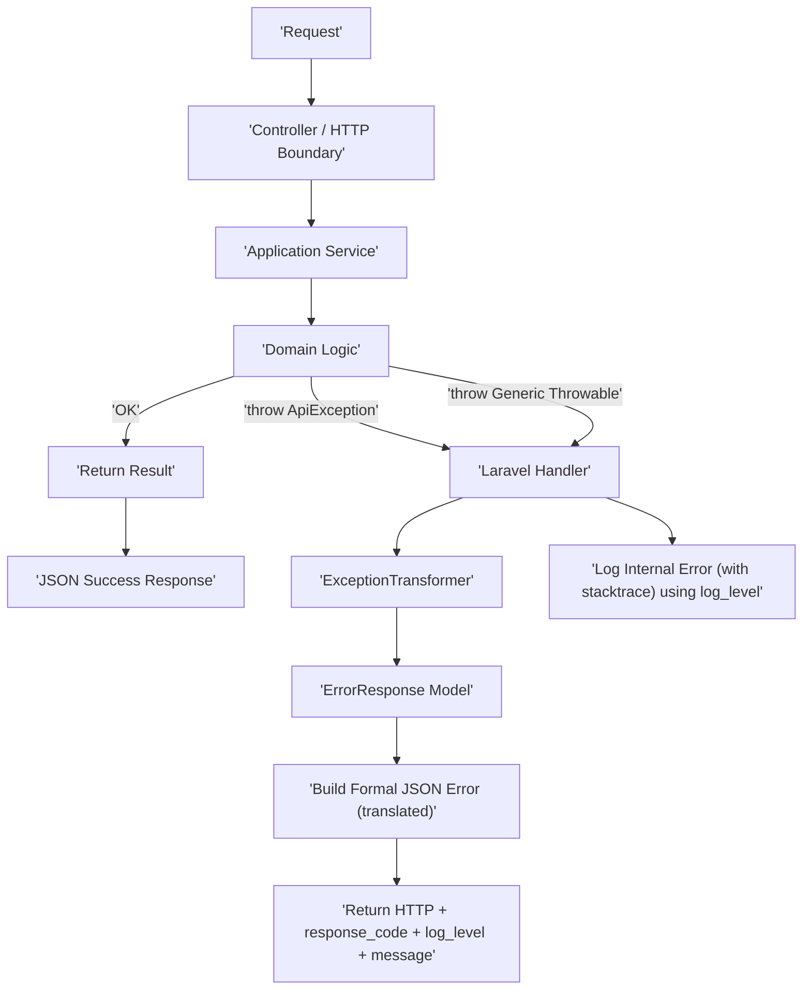

# Exception-Driven Application Flow in Laravel

## Abstract

Modern backend applications need *predictable* error handling, consistent API responses, and a clean separation between domain logic and transport concerns. In many Laravel codebases, error handling slowly degrades into a mix of boolean returns, ad‑hoc arrays, scattered `abort()` calls, duplicated JSON shapes, and inconsistent HTTP status usage. The result is brittle clients, noisy controllers, and business code polluted by boundary concerns.

This article describes an **Exception‑Driven Application Flow** implemented in Laravel, where abnormal states are modeled as **dedicated exception classes** and translated at the HTTP boundary into **structured JSON responses** by a centralized handler. The approach enforces explicit error modeling, guarantees a stable **application response code** (machine‑readable contract), centralizes **logging with severity levels**, supports **i18n translation** in one place, and enables targeted tests (domain tests asserting exceptions; HTTP tests asserting response shape and codes).

The key idea is simple: **the domain throws meaning; the boundary translates meaning**.

---

## 1. The Contract: Stable `response_code` (Mandatory)

A hard rule:

**Every error response MUST contain an application-level `response_code`.**

- ✅ stable over time (clients rely on it)
- ✅ unique within the system
- ✅ not derived from exception message
- ✅ not language-dependent
- ✅ independent from HTTP status (HTTP is too coarse)

If a developer creates an exception without a response code, the system should treat it as a bug in the error model and fall back to a safe generic code.

---

## 2. Base `ApiException` (with PSR-3 log level)

All application exceptions extend a common base class that defines the response contract.

```php
<?php

declare(strict_types=1);

namespace App\Exceptions;

use Exception;
use Psr\Log\LogLevel;

abstract class ApiException extends Exception
{
    /**
     * HTTP status code (e.g. 400, 403, 404, 422, 500).
     */
    abstract public function statusCode(): int;

    /**
     * Application-level stable code (API contract).
     * Example: "USER_NOT_AUTHORIZED", "VIDEO_THUMBNAIL_INVALID_DIMENSIONS".
     */
    abstract public function responseCode(): string;

    /**
     * Translation key used by the handler.
     */
    abstract public function translationKey(): string;

    /**
     * PSR-3 severity level used by the handler for logging,
     * and returned to the client as metadata.
     *
     * Allowed values: see \Psr\Log\LogLevel constants.
     */
    public function logLevel(): string
    {
        return LogLevel::ERROR;
    }

    /**
     * Extra structured info that will be logged (not necessarily exposed).
     */
    public function context(): array
    {
        return [];
    }

    /**
     * Optional: safe public payload additions (kept minimal).
     */
    public function publicMeta(): array
    {
        return [];
    }
}
```

---

## 3. Exception Example #1: Authorization (403)

```php
<?php

declare(strict_types=1);

namespace App\Exceptions\User;

use App\Exceptions\ApiException;
use Psr\Log\LogLevel;
use Symfony\Component\HttpFoundation\Response;

final class UserNotAuthorizedException extends ApiException
{
    public function statusCode(): int
    {
        return Response::HTTP_FORBIDDEN;
    }

    public function responseCode(): string
    {
        return 'USER_NOT_AUTHORIZED';
    }

    public function translationKey(): string
    {
        return 'errors.user.not_authorized';
    }

    public function logLevel(): string
    {
        // Not necessarily an "error": could be expected behavior.
        return LogLevel::NOTICE;
    }
}
```

---

## 4. Exception Example #2: Validation-like failure with context (422)

Example: user uploads a custom thumbnail but its dimensions are invalid.

```php
<?php

declare(strict_types=1);

namespace App\Exceptions\Video;

use App\Exceptions\ApiException;
use Psr\Log\LogLevel;
use Symfony\Component\HttpFoundation\Response;

final class CustomThumbnailInvalidDimensionsException extends ApiException
{
    public function __construct(
        private readonly int $width,
        private readonly int $height,
        private readonly int $minWidth,
        private readonly int $minHeight,
        private readonly ?int $videoId = null
    ) {
        parent::__construct('Invalid custom thumbnail dimensions');
    }

    public function statusCode(): int
    {
        return Response::HTTP_UNPROCESSABLE_ENTITY; // 422
    }

    public function responseCode(): string
    {
        return 'VIDEO_THUMBNAIL_INVALID_DIMENSIONS';
    }

    public function translationKey(): string
    {
        return 'errors.video.thumbnail_invalid_dimensions';
    }

    public function logLevel(): string
    {
        // Input issue; usually not a server error.
        return LogLevel::INFO;
    }

    public function context(): array
    {
        return [
            'video_id' => $this->videoId,
            'width' => $this->width,
            'height' => $this->height,
            'min_width' => $this->minWidth,
            'min_height' => $this->minHeight,
        ];
    }

    public function publicMeta(): array
    {
        // Safe + useful for clients (no stack traces, no internals).
        return [
            'width' => $this->width,
            'height' => $this->height,
            'min_width' => $this->minWidth,
            'min_height' => $this->minHeight,
        ];
    }
}
```

Usage stays linear:

```php
if ($width < 640 || $height < 360) {
    throw new CustomThumbnailInvalidDimensionsException(
        width: $width,
        height: $height,
        minWidth: 640,
        minHeight: 360,
        videoId: $videoId
    );
}
```

---

## 5. Generic Exception Handling via a Transformer

Even if a generic `Throwable` occurs (unknown exception, vendor bug, runtime error), the API should still return a consistent JSON shape.

We introduce:
- an `ExceptionTransformerInterface` (file 1)
- a `DefaultExceptionTransformer` (file 2)

### 5.1 Response model (`ErrorResponse`)

```php
<?php

declare(strict_types=1);

namespace App\Exceptions\Transformers;

final class ErrorResponse
{
    public function __construct(
        public readonly int $httpStatus,
        public readonly string $responseCode,
        public readonly string $translationKey,
        public readonly string $logLevel,
        public readonly array $publicMeta = [],
        public readonly array $logContext = []
    ) {}
}
```

### 5.2 File 1: `ExceptionTransformerInterface.php`

```php
<?php

declare(strict_types=1);

namespace App\Exceptions\Transformers;

use Throwable;

interface ExceptionTransformerInterface
{
    public function transform(Throwable $e): ErrorResponse;
}
```

### 5.3 File 2: `DefaultExceptionTransformer.php`

```php
<?php

declare(strict_types=1);

namespace App\Exceptions\Transformers;

use App\Exceptions\ApiException;
use Illuminate\Validation\ValidationException;
use Psr\Log\LogLevel;
use Symfony\Component\HttpFoundation\Response;
use Throwable;

final class DefaultExceptionTransformer implements ExceptionTransformerInterface
{
    public function transform(Throwable $e): ErrorResponse
    {
        // Contract-based exceptions
        if ($e instanceof ApiException) {
            return new ErrorResponse(
                httpStatus: $e->statusCode(),
                responseCode: $e->responseCode(),
                translationKey: $e->translationKey(),
                logLevel: $e->logLevel(),
                publicMeta: $e->publicMeta(),
                logContext: $e->context()
            );
        }

        // Laravel validation exception (example)
        if ($e instanceof ValidationException) {
            return new ErrorResponse(
                httpStatus: Response::HTTP_UNPROCESSABLE_ENTITY,
                responseCode: 'VALIDATION_FAILED',
                translationKey: 'errors.validation.failed',
                logLevel: LogLevel::INFO,
                publicMeta: [
                    'fields' => $e->errors(),
                ],
                logContext: [
                    'validation_errors' => $e->errors(),
                ]
            );
        }

        // Fallback: unknown exception
        return new ErrorResponse(
            httpStatus: Response::HTTP_INTERNAL_SERVER_ERROR,
            responseCode: 'INTERNAL_ERROR',
            translationKey: 'errors.internal',
            logLevel: LogLevel::ERROR,
            publicMeta: [],
            logContext: []
        );
    }
}
```

---

## 6. Centralized Laravel Handler (logs + translates + responds)

Key guarantees:
- always logs internally with stacktrace (by passing the exception)
- always returns JSON with a stable `response_code`
- always includes a `log_level` field in the JSON
- uses the transformer for both known and unknown exceptions

```php
<?php

declare(strict_types=1);

namespace App\Exceptions;

use App\Exceptions\Transformers\ErrorResponse;
use App\Exceptions\Transformers\ExceptionTransformerInterface;
use Illuminate\Foundation\Exceptions\Handler as ExceptionHandler;
use Illuminate\Http\JsonResponse;
use Psr\Log\LogLevel;
use Throwable;

final class Handler extends ExceptionHandler
{
    public function __construct(
        private readonly ExceptionTransformerInterface $transformer
    ) {
        parent::__construct(app());
    }

    public function render($request, Throwable $e): JsonResponse
    {
        $error = $this->transformer->transform($e);

        // Strict enforcement: response_code is mandatory
        if (trim($error->responseCode) === '') {
            // Treat as a dev bug, but keep public response safe.
            $error = new ErrorResponse(
                httpStatus: 500,
                responseCode: 'INTERNAL_ERROR',
                translationKey: 'errors.internal',
                logLevel: LogLevel::ERROR,
                publicMeta: [],
                logContext: ['original_exception' => get_class($e)]
            );
        }

        // Internal logging with PSR-3 severity and stacktrace.
        logger()->log(
            $error->logLevel,
            $e->getMessage(),
            array_merge(['exception' => $e], $error->logContext)
        );

        // Formal public response (translated, stable shape)
        return response()->json([
            'success' => false,
            'error' => [
                'response_code' => $error->responseCode,
                'log_level' => $error->logLevel,
                'message' => __($error->translationKey),
                'meta' => (object) $error->publicMeta,
            ],
        ], $error->httpStatus);
    }
}
```

---

## 7. Guaranteed JSON Error Shape

Example:

```json
{
  "success": false,
  "error": {
    "response_code": "VIDEO_THUMBNAIL_INVALID_DIMENSIONS",
    "log_level": "info",
    "message": "The provided thumbnail has invalid dimensions.",
    "meta": {
      "width": 320,
      "height": 240,
      "min_width": 640,
      "min_height": 360
    }
  }
}
```

---

## 8. Localization Strategy (single boundary)

Translations are handled exclusively in the handler via translation keys.

```php
// resources/lang/en/errors.php
return [
    'user' => [
        'not_authorized' => 'You are not allowed to access this resource.',
    ],
    'video' => [
        'thumbnail_invalid_dimensions' => 'The provided thumbnail has invalid dimensions.',
    ],
    'validation' => [
        'failed' => 'Some fields are invalid.',
    ],
    'internal' => 'Unexpected error. Please try again later.',
];
```

---

## 9. Testing Strategy (exception-oriented)

### Domain test: assert the exception type

```php
$this->expectException(\App\Exceptions\Video\CustomThumbnailInvalidDimensionsException::class);

$service->execute($command);
```

### HTTP test: assert stable contract (`response_code`)

```php
$response = $this->postJson('/api/video/thumbnail', $payload);

$response
    ->assertStatus(422)
    ->assertJsonPath('error.response_code', 'VIDEO_THUMBNAIL_INVALID_DIMENSIONS')
    ->assertJsonPath('error.log_level', 'info');
```

---

## 10. Workflow Diagram (Mermaid)



---

## Conclusion

This pattern is not about “throwing exceptions everywhere”. It is about making abnormal states **explicit**, **typed**, and **centrally managed**, while keeping domain logic free from HTTP and JSON concerns. The combination of stable `response_code`, PSR-3 `log_level`, and a transformer-backed handler makes API behavior predictable and testable, without compromising internal observability.
