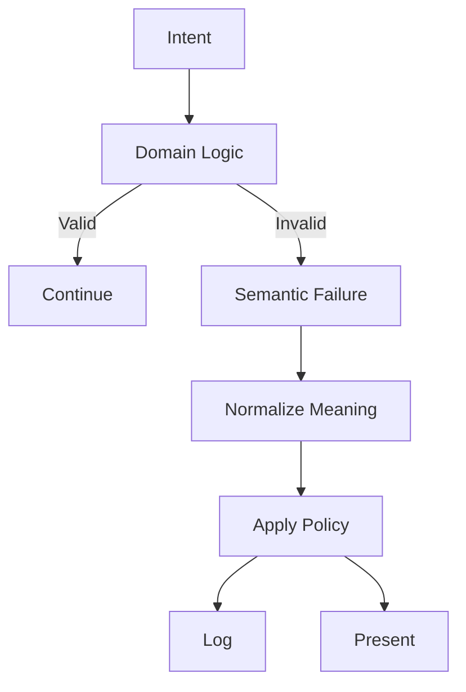

# Exception-Driven Application Flow in Laravel

This document is intended for senior backend developers, tech leads, and software architects working with medium-to-large Laravel codebases. It assumes familiarity with modern PHP (>=8.1), OOP, SOLID principles, and layered application architectures.

This document defines:

* a complete architectural model for error handling
* strict, non-negotiable rules
* a reference implementation approach

covering HTTP APIs, CLI commands, and extensible transports (gRPC, async workers).

This document does not:

* replace framework documentation
* enforce a specific domain style (DDD on/off)
* describe observability stacks (ELK, OTEL)

---

## Introduction

This architecture exists to stop a slow, very real failure mode in PHP backends: **every team invents its own error-handling dialect**.

At first it looks harmless. One controller returns arrays, another throws, a third calls `abort()`. Six months later your API contract is a patchwork and the client has to guess what happened.

A concrete example (common in Laravel codebases): a controller that mixes **business meaning** with **policy** (status codes, payload shape, logging, and user-facing messages).

```php
<?php
// "Return arrays" style: policy leaks everywhere.
public function uploadThumbnail(Request $request): JsonResponse
{
    $width = (int) $request->input('width');
    $height = (int) $request->input('height');

    // Domain meaning: thumbnail is too small.
    // Policy decisions (problematic here): HTTP status, payload schema, logging, and message text.
    if ($width < 640 || $height < 360) {
        logger()->info('Thumbnail too small', ['width' => $width, 'height' => $height]);

        return response()->json([
            'success' => false,
            'error' => [
                // Some controllers use response_code, others don't. Some nest meta, others flatten it.
                'response_code' => 'THUMBNAIL_TOO_SMALL',
                'message' => 'Thumbnail too small',
                'meta' => ['width' => $width, 'height' => $height],
            ],
        ], 422);
    }

    // ... more checks, more duplicated mapping rules, more payload variations ...

    return response()->json(['success' => true]);
}
```

Now compare with an exception-driven flow:

```php
<?php
// "Throw meaning" style: domain/validation expresses semantics only.
public function uploadThumbnail(Request $request): JsonResponse
{
    $width = (int) $request->input('width');
    $height = (int) $request->input('height');

    VideoGuards::thumbnailIsLargeEnough($width, $height);

    return response()->json(['success' => true]);
}
```

Here the controller stops being an error-policy factory. It expresses intent and delegates meaning to the domain. The boundary (global handler / middleware / subscriber) becomes the **single point** that decides, consistently:

* which transport status to use
* the exact error payload shape
* which `response_code` is exposed as contract
* what and how to log
* how to translate user-facing messages

One clarification up front: **this is not about using exceptions as a substitute for normal branching.** Exceptions represent abnormal states or boundary outcomes; if the caller can continue meaningfully, don’t throw.

The core idea is pragmatic:

**move all error policy out of core logic and enforce it at the boundary**.

Developers focus on meaning (what is valid, what is not, what must never happen). Everything else—logging, translation, serialization, protocol mapping—is centralized and enforced consistently.

### Contract

This document specifies an **exception-driven application flow** for PHP backends (Laravel) where semantic failures are expressed as typed exceptions and translated at the boundary into transport-specific responses.

An implementation conforming to this document:

* MUST model abnormal states as **semantic exceptions** (not boolean returns or ad-hoc arrays)
* MUST expose a stable, machine-readable **response_code** as the primary client contract
* MUST keep transport policy (HTTP status codes, exit codes, gRPC status, messages, logging strategy) **out of domain code**
* MUST normalize any `Throwable` into a canonical **Error DTO** via an ErrorAdapter
* MUST present errors through a consistent transport payload/schema (HTTP/CLI/gRPC)
* SHOULD translate human-facing messages only at the boundary (i18n), never in domain logic
* MUST test contracts by asserting `response_code` and status, not translated messages
* `response_code` is the primary machine contract; `log_level` is a secondary semantic classification

Guiding principle:

**the domain throws meaning; the boundary translates meaning**.

---

## Core Principles (Non-Negotiable)

### Exception ≠ Control Flow

Exceptions represent **abnormal states or boundary outcomes**, not alternative execution paths. They must never replace conditional branching or be used for normal flow control.

**Wrong (exceptions as goto):**

```php
<?php
public function handle(Request $request): JsonResponse
{
    try {
        $user = $this->auth->requireUser($request);
        $this->service->doWork($user);
    } catch (Throwable $e) {
        // “Anything bad => 200 with success=false” or “just swallow and continue”.
        return response()->json(['success' => false]);
    }

    // Execution continues with unknown state.
    return response()->json(['success' => true]);
}
```

**Correct (exceptions for abnormal outcomes, handled at the boundary):**

```php
<?php
public function handle(Request $request): JsonResponse
{
    $user = $this->auth->requireUser($request); // may throw NotAuthenticated/NotAuthorized

    $this->service->doWork($user);              // may throw semantic domain exceptions

    return response()->json(['success' => true]);
}
```

Valid uses include authorization failures, invalid input, invariant violations, and impossible states. If the caller can continue execution meaningfully, an exception is the wrong tool.

### Assertion ≠ Business Decision

Assertions protect **domain invariants** and fail fast. They must never encode reversible business decisions or optional paths.

Put differently: assertions are for “this must never be false in a valid system state”, not for policy rules like “if risk_score > X then require extra verification” (that’s a business policy path, not an invariant).

### Boundary Owns Policy

The domain does not decide:

* HTTP status codes
* exit codes
* client messages
* logging strategies

All policy decisions belong to the application boundary.

**If your domain knows HTTP, you already lost.**

Semantic severity vs logging strategy
`log_level` is a semantic severity hint attached to the error meaning (PSR-3 level). It classifies how expected/critical the failure is. The boundary may use it for logging and may expose it to clients, but transport-specific decisions remain boundary-owned.

### Stable Contracts > Messages

Messages are for humans and change over time. Contracts are for machines and must remain stable. Clients must rely on contracts, not on messages.

---

## Exception-Driven Flow

The conceptual flow is:

1. The domain evaluates a rule
2. A rule violation produces a semantic failure
3. The failure is expressed as a typed exception
4. The exception propagates to the boundary
5. The boundary normalizes meaning, applies policy, and produces output

No intermediate handling is allowed unless explicit recovery is possible.

---

## `response_code` as Business Contract

Exceptions MUST propagate unchanged until the boundary. Intermediate try/catch is forbidden unless performing explicit recovery. The boundary is responsible for normalization, enrichment, and presentation.

Rules:

* stable over time
* unique within its domain
* language-independent
* not derived from messages
* independent from transport
* “MUST NOT reuse a response_code for a different meaning”
* “Changing text/translation MUST NOT change response_code”

HTTP status codes are too coarse and contextual to represent business meaning.

---

## ErrorCode Design (Domain-Scoped Enums)

A single global error enum does not scale. Each domain owns its own error codes.

The core idea is:

* each domain defines its own enum (VideoErrorCode, UserErrorCode, BillingErrorCode, ...)
* all enums implement a shared interface (`ErrorCodeInterface`)
* transport mappings (HTTP / CLI / gRPC) are owned by the application boundary via a policy map, not by domain enums

Additionally, define a small, framework-level Platform domain enum for cross-cutting fallbacks (e.g. unexpected runtime errors). This repository uses `PlatformErrorCode` with `INTERNAL_SERVER_ERROR` as the default fallback response_code. The Platform domain is the only allowed cross-cutting enum; all other error codes are domain-scoped.

### Interface

```php
<?php
declare(strict_types=1);

namespace ExceptionDriven\ErrorHandling;

interface ErrorCodeInterface
{
    /**
     * Stable business identifier (API contract).
     */
    public function responseCode(): string;

    /**
     * Translation key used by the boundary.
     */
    public function translationKey(): string;
}
```

### Example: Video domain enum

```php
<?php
declare(strict_types=1);

namespace ExceptionDriven\Domain\Video;

use ExceptionDriven\ErrorHandling\ErrorCodeInterface;

enum VideoErrorCode: string implements ErrorCodeInterface
{
    case THUMBNAIL_INVALID_DIMENSIONS = 'VIDEO_THUMBNAIL_INVALID_DIMENSIONS';
    case VIDEO_NOT_FOUND = 'VIDEO_NOT_FOUND';

    public function responseCode(): string
    {
        return $this->value;
    }

    public function translationKey(): string
    {
        return match ($this) {
            self::THUMBNAIL_INVALID_DIMENSIONS => 'errors.video.thumbnail_invalid_dimensions',
            self::VIDEO_NOT_FOUND => 'errors.video.not_found',
        };
    }

}
```

### Platform fallback enum

This enum (Platform domain) is used by the ErrorAdapter when an unknown `Throwable` needs to be mapped into a stable contract. Do not use it for domain semantics.

```php
<?php
declare(strict_types=1);

enum PlatformErrorCode: string implements ErrorCodeInterface
{
    case INTERNAL_SERVER_ERROR = 'INTERNAL_SERVER_ERROR';

    public function responseCode(): string
    {
        return $this->value;
    }

    public function translationKey(): string
    {
        return match ($this) {
            self::INTERNAL_SERVER_ERROR => 'errors.platform.internal_server_error',
        };
    }

    // Transport mappings are owned by the application policy map,
    // not by domain/system enums.
}
```

Notes:

* Keeping transport mappings in a single application-level policy map prevents duplicated mapping tables scattered in handlers/presenters.
* `translationKey()` is stable; the translated text is not

---

## ApiExceptionInterface

`ApiExceptionInterface` is the minimal contract required for a semantic exception to participate in this architecture.

The boundary depends on this **interface**, not on a specific base class.

```php
<?php
declare(strict_types=1);

namespace ExceptionDriven\Exceptions;

use ExceptionDriven\ErrorHandling\ErrorCodeInterface;
use Throwable;

interface ApiExceptionInterface extends Throwable
{
    public function codeEnum(): ErrorCodeInterface;

    /**
     * PSR-3 severity level (e.g. LogLevel::INFO).
     */
    public function logLevel(): string;

    /**
     * Translation placeholders.
     *
     * @return array<string,mixed>
     */
    public function messageParams(): array;

    /**
     * Extra structured info for logs (internal).
     *
     * @return array<string,mixed>
     */
    public function context(): array;

    /**
     * Extra structured info safe for clients.
     *
     * @return array<string,mixed>
     */
    public function publicMeta(): array;
}
```

---

## ApiException Base Class

`ApiException` is the semantic base class. Concrete exceptions should:

* declare an error code (domain enum)
* declare the log level (PSR-3)
* optionally provide structured context and safe public metadata

`ApiException` should *not* contain any transport or presentation behavior.

```php
<?php
declare(strict_types=1);

namespace ExceptionDriven\Exceptions;

use ExceptionDriven\ErrorHandling\ErrorCodeInterface;
use Psr\Log\LogLevel;
use Exception;

abstract class ApiException extends Exception implements ApiExceptionInterface
{
    /**
     * Each exception must map to a domain-owned error code.
     */
    abstract public static function code(): ErrorCodeInterface;

    /**
     * PSR-3 severity. Concrete exceptions override via constant.
     */
    public const LOG_LEVEL = LogLevel::ERROR;

    final public function codeEnum(): ErrorCodeInterface
    {
        return static::code();
    }

    final public function logLevel(): string
    {
        return static::LOG_LEVEL;
    }

    /**
     * Translation placeholders.
     *
     * @return array<string,mixed>
     */
    public function messageParams(): array
    {
        return [];
    }


    /**
     * Extra structured info for logs (internal).
     *
     * @return array<string,mixed>
     */
    public function context(): array
    {
        return [];
    }

    /**
     * Extra structured info safe for clients.
     *
     * @return array<string,mixed>
     */
    public function publicMeta(): array
    {
        return [];
    }
}
```

---

## Domain Exceptions (Examples)

Domain exceptions represent specific, semantic failure cases. Each exception class must be precise, explicit, and owned by the domain that defines the rule.

### Authorization example

```php
<?php
declare(strict_types=1);

namespace ExceptionDriven\Domain\User\Exceptions;

use ExceptionDriven\Exceptions\ApiException;
use ExceptionDriven\ErrorHandling\ErrorCodeInterface;
use ExceptionDriven\Domain\User\UserErrorCode;
use Psr\Log\LogLevel;

final class UserNotAuthorizedException extends ApiException
{
    public const LOG_LEVEL = LogLevel::NOTICE;

    public static function code(): ErrorCodeInterface
    {
        return UserErrorCode::NOT_AUTHORIZED;
    }
}
```

### Validation-like example

```php
<?php
declare(strict_types=1);

namespace ExceptionDriven\Domain\Video\Exceptions;

use ExceptionDriven\Exceptions\ApiException;
use ExceptionDriven\ErrorHandling\ErrorCodeInterface;
use ExceptionDriven\Domain\Video\VideoErrorCode;
use Psr\Log\LogLevel;

final class ThumbnailInvalidDimensionsException extends ApiException
{
    public const LOG_LEVEL = LogLevel::INFO;

    public function __construct(
        private int $width,
        private int $height
    ) {
        parent::__construct('Invalid thumbnail dimensions');
    }

    public static function code(): ErrorCodeInterface
    {
        return VideoErrorCode::THUMBNAIL_INVALID_DIMENSIONS;
    }

    public function publicMeta(): array
    {
        return ['width' => $this->width, 'height' => $this->height];
    }
}
```

These exceptions encode meaning only; no transport logic is present.

---

## Guards & Assertions

Guards and assertions protect domain invariants and remove defensive branching from core logic. They fail fast by throwing semantic exceptions and never attempt recovery.

They also cover validation-like rules when they are boundary constraints: preconditions at module boundaries (e.g., controller → domain), data shape/format checks, or contract constraints that must hold for the domain to proceed. They are not business policy branches nor reversible decisions.

```php
<?php
declare(strict_types=1);

namespace ExceptionDriven\Domain\Video;

use ExceptionDriven\Domain\Video\Exceptions\ThumbnailInvalidDimensionsException;

final class VideoGuards
{
    public static function thumbnailIsLargeEnough(int $width, int $height): void
    {
        if ($width < 640 || $height < 360) {
            throw new ThumbnailInvalidDimensionsException($width, $height);
        }
    }
}
```

Assertions make invariants explicit, self-documenting, and trivially testable.

---

## Error DTO

The Error DTO is the internal, canonical representation of an error. All transports operate from this model.

It contains:

* the semantic error code (business contract)
* a `message_key` (translation key)
* optional `message_params` (translation placeholders)
* the severity level (PSR-3)
* public metadata (safe for clients)
* structured logging context (internal-only)
* an `error_id` (ULID/UUID) chosen from `X-Request-ID`/`X-Correlation-ID`/`traceparent` if present, otherwise generated at the boundary

This guarantees a single source of truth for error handling.

### Reference implementation

```php
<?php
declare(strict_types=1);

namespace ExceptionDriven\ErrorHandling;

final class ErrorDto
{
    /**
     * @param array<string,mixed> $messageParams
     * @param array<string,mixed> $meta
     * @param array<string,mixed> $logContext
     */
    public function __construct(
        public readonly ErrorCodeInterface $code,
        public readonly string $messageKey,
        public readonly array $messageParams,
        public readonly string $logLevel,
        public readonly array $meta = [],
        public readonly array $logContext = [],
        public readonly string $errorId = '',
    ) {}

    public function responseCode(): string
    {
        return $this->code->responseCode();
    }
}
```

### Notes

* `meta` must contain only client-safe information (no stack traces, no SQL, no internal identifiers unless explicitly allowed).
* `logContext` is meant for structured logs and debugging. Keep it stable and machine-readable.
* `message_key` and `message_params` should come from the semantic error (exception/code). The final human message is resolved by the presenter at the boundary (not from the exception message).
* `log_level` is semantic (part of the error meaning), not transport policy. It is stable enough to be used by client UI/telemetry, but it must not replace `response_code` as the primary contract. Clients MAY use it for UI hints; MUST rely on `response_code` for logic.

---

## ErrorAdapter

The ErrorAdapter converts any `Throwable` into an `ErrorDto`.

Responsibilities:

* read `ErrorCodeInterface` + log level + metadata from semantic exceptions
* map unknown throwables to PlatformErrorCode::INTERNAL_SERVER_ERROR and enrich log context for diagnostics
* collect structured logging context

Unknown exceptions are treated as `INTERNAL_SERVER_ERROR` by default.

### Adapter interface

```php
<?php
declare(strict_types=1);

namespace ExceptionDriven\ErrorHandling;

use Throwable;

interface ErrorAdapterInterface
{
    public function toDto(Throwable $e, string $errorId): ErrorDto;
}
```

### Semantic exceptions contract

The adapter must not depend on a specific base class. Any exception can participate as long as it implements `ApiExceptionInterface` (defined earlier).

### Fallback mapping (no extra exception class)

When the application hits an unknown `Throwable` (vendor bug, runtime error, `TypeError`, etc.), the adapter maps it directly to a stable fallback code (e.g. `INTERNAL_SERVER_ERROR`) and enriches the log context for diagnostics.

The transport policy map MUST define default mappings for `PlatformErrorCode::INTERNAL_SERVER_ERROR` (HTTP 500, CLI 1, gRPC INTERNAL).
If a code is not explicitly mapped, the policy MUST fall back to the Platform default mapping.

### Default adapter (reference implementation)

The adapter does not translate messages. It only produces a canonical DTO with a translation key + params.

```php
<?php
declare(strict_types=1);

namespace ExceptionDriven\ErrorHandling;

use ExceptionDriven\Exceptions\ApiExceptionInterface;
use Psr\Log\LogLevel;

final class DefaultErrorAdapter implements ErrorAdapterInterface
{
    public function toDto(Throwable $e, string $errorId): ErrorDto
    {
        if ($e instanceof ApiExceptionInterface) {
            $code = $e->codeEnum();

            return new ErrorDto(
                code: $code,
                messageKey: $code->translationKey(),
                messageParams: $e->messageParams(),
                logLevel: $e->logLevel(),
                meta: $e->publicMeta(),
                logContext: $e->context(),
                errorId: $errorId,
            );
        }

        $code = PlatformErrorCode::INTERNAL_SERVER_ERROR;

        return new ErrorDto(
            code: $code,
            messageKey: $code->translationKey(),
            messageParams: [],
            logLevel: LogLevel::ERROR,
            meta: [],
            logContext: [
                'exception_class' => get_class($e),
                'exception_message' => $e->getMessage(), // avoid PII
                'exception_code' => $e->getCode(),
                'exception_file' => $e->getFile(),
                'exception_line' => $e->getLine(),
                'exception_fingerprint' => sprintf('%s@%s:%d', get_class($e), $e->getFile(), $e->getLine()),
            ],
            errorId: $errorId,
        );
    }
}
```

---

## Transport Policy Map

The Transport Policy Map is the boundary-owned component responsible for translating a semantic `ErrorCodeInterface` into transport-specific outcomes. It exists to keep transport policy out of domain code while still enforcing a consistent, centralized mapping across HTTP, CLI, gRPC, and other transports.

### Responsibilities

The Transport Policy Map:
- resolves HTTP status for a given `ErrorCodeInterface`
- resolves CLI exit code for a given `ErrorCodeInterface`
- resolves gRPC status for a given `ErrorCodeInterface`
- provides deterministic defaults for unknown/unmapped codes

It does not:
- define business meaning (`response_code`)
- translate messages (i18n)
- decide logging strategy

### Rules (Non-Negotiable)

- The policy map MUST be owned by the application boundary (framework layer).
- Domain enums MUST NOT contain transport mappings.
- The policy map MUST define the default mapping for `PlatformErrorCode::INTERNAL_SERVER_ERROR`:
  - HTTP: 500
  - CLI: 1
  - gRPC: INTERNAL (status code 13)
- If a code is not explicitly mapped, the policy map MUST fall back to the Platform default mapping.

### Interface (reference)

```php
<?php
declare(strict_types=1);

namespace ExceptionDriven\Policy;

use ExceptionDriven\ErrorHandling\ErrorCodeInterface;

interface TransportPolicyInterface
{
    public function httpStatus(ErrorCodeInterface $code): int;

    /**
     * @return int Exit code
     */
    public function cliExitCode(ErrorCodeInterface $code): int;

    /**
     * @return int gRPC status code (e.g. 13 = INTERNAL)
     */
    public function grpcStatus(ErrorCodeInterface $code): int;
}
```

### Notes

- The Transport Policy Map is part of the boundary contract: changing a mapping (e.g. 422 → 400) is a contract change and should be covered by boundary/integration tests.
- Mappings can be implemented using a lookup table keyed by `responseCode()`, by enum class + case, or by explicit rule objects—implementation details are flexible as long as the rules above remain true.

---

## Presenters

Presenters adapt an `ErrorDto` to a specific transport and format. They use an application-level Transport Policy Map to resolve transport-specific details (HTTP status, CLI exit code, gRPC status).

They:

* format output (JSON, console text, gRPC error)
* apply transport mappings (HTTP status, exit code, gRPC status)

They never:

* decide error meaning
* create response codes
* contain business logic

### Presenter registry (by transport)

Per rendere plug-and-play nuovi canali (HTTP, HTML, CLI, gRPC, …) usa un enum di trasporto e un registry centralizzato.

```php
<?php
declare(strict_types=1);

namespace ExceptionDriven\Presentation;

use Illuminate\Http\Request;

enum Transport: string
{
    case HTTP_JSON = 'http_json';
    case HTTP_HTML = 'http_html';
    case CLI = 'cli';
    case GRPC = 'grpc';
}

interface ErrorPresenterRegistryInterface
{
    public function resolveForHttp(Request $request): ErrorPresenterInterface;
    /** @return object One of: HttpErrorPresenter|HtmlErrorPresenter|CliErrorPresenter|GrpcErrorPresenter */
    public function get(Transport $transport): object;
}

final class DefaultErrorPresenterRegistry implements ErrorPresenterRegistryInterface
{
    public function __construct(
        private readonly HttpErrorPresenter $http,
        private readonly HtmlErrorPresenter $html,
        private readonly CliErrorPresenter $cli,
        private readonly GrpcErrorPresenter $grpc,
    ) {}

    public function resolveForHttp(Request $request): ErrorPresenterInterface
    {
        $accept = (string) $request->headers->get('Accept', '');
        if (stripos($accept, 'application/json') !== false) { return $this->http; }
        if (stripos($accept, 'text/html') !== false) { return $this->html; }
        return $request->expectsJson() ? $this->http : $this->html;
    }

    public function get(Transport $transport): object
    {
        return match ($transport) {
            Transport::HTTP_JSON => $this->http,
            Transport::HTTP_HTML => $this->html,
            Transport::CLI => $this->cli,
            Transport::GRPC => $this->grpc,
        };
    }
}
```

### HTTP presenter

**HTTP presenter**

```php
<?php
declare(strict_types=1);

namespace ExceptionDriven\Presentation;

use ExceptionDriven\ErrorHandling\ErrorDto;
use ExceptionDriven\Policy\TransportPolicyInterface;
use Illuminate\Http\JsonResponse;

final class HttpErrorPresenter
{
    public function present(ErrorDto $dto): JsonResponse
    {
        // Translation is a boundary service (framework i18n), not domain logic.
        $message = __($dto->messageKey, $dto->messageParams);

        $error = [
            'response_code' => $dto->responseCode(),
            'log_level' => $dto->logLevel,
            'message' => $message,
            'meta' => (object) $dto->meta,
            'error_id' => $dto->errorId,
        ];

        return new JsonResponse([
            'success' => false,
            'error' => $error,
        ], app(TransportPolicyInterface::class)->httpStatus($dto->code));
    }
}
```

### HTML/Blade presenter

If your route renders HTML with Blade instead of JSON, add a dedicated presenter that transforms the Error DTO into a view response. Use a presenter selection strategy to choose the presenter for the request.

```php
<?php
declare(strict_types=1);

namespace ExceptionDriven\Presentation;

use ExceptionDriven\ErrorHandling\ErrorDto;
use ExceptionDriven\Policy\TransportPolicyInterface;
use Illuminate\Http\Response;

final class HtmlErrorPresenter
{
    public function present(ErrorDto $dto): Response
    {
        // Translation is a boundary service (framework i18n), not domain logic.
        $message = __($dto->messageKey, $dto->messageParams);

        return response()->view('errors.generic', [
            'response_code' => $dto->responseCode(),
            'message' => $message,
            'meta' => $dto->meta,
            'error_id' => $dto->errorId,
        ], app(TransportPolicyInterface::class)->httpStatus($dto->code));
    }
}
```
### Security note (meta in HTML)
meta is client-safe by definition, but it is not automatically user-displayable. In HTML/Blade responses you SHOULD avoid rendering meta entirely (prefer showing only error_id + a generic message).
If you decide to show any meta fields, you MUST escape output (never render raw/unescaped values) and you SHOULD restrict to an explicit allowlist of fields intended for end-users. Never include stack traces, SQL, internal identifiers, or free-form strings that may contain user-controlled content.

In the Laravel handler:

```php
<?php
declare(strict_types=1);

namespace ExceptionDriven\Exceptions;

use ExceptionDriven\ErrorHandling\ErrorAdapterInterface;
use ExceptionDriven\Presentation\ErrorPresenterRegistryInterface;
use Illuminate\Support\Str;
use Throwable;

$this->renderable(function (Throwable $e, $request) {
    $errorId =
        $request?->headers->get('X-Request-ID')
        ?? $request?->headers->get('X-Correlation-ID')
        ?? $request?->headers->get('traceparent')
        ?? (string) Str::ulid();

    $dto = app(ErrorAdapterInterface::class)->toDto($e, (string) $errorId);

    $context = $dto->logContext;
    $context['exception'] = $e; // PSR-3 convention
    logger()->log($dto->logLevel, $e->getMessage(), $context);

    $presenter = app(ErrorPresenterRegistryInterface::class)->resolveForHttp($request);
    return $presenter->present($dto);
});
```

This is not the Template Method pattern; it’s a simple Presenter/Adapter at the boundary that formats the same DTO into different transports (JSON/HTML/CLI/gRPC).

Nota: per l’integrazione in Laravel, vedi:
- [Presenters](#presenters)
- [HTML/Blade presenter](#htmlblade-presenter) (include lo snippet per l’Handler Laravel)


### CLI presenter

**CLI presenter**

```php
<?php
declare(strict_types=1);

namespace ExceptionDriven\Presentation;

use ExceptionDriven\ErrorHandling\ErrorDto;
use ExceptionDriven\Policy\TransportPolicyInterface;

final class CliErrorPresenter
{
    /**
     * @return int Exit code
     */
    public function present(ErrorDto $dto): int
    {
        // Translation is a boundary service (framework i18n), not domain logic.
        $message = __($dto->messageKey, $dto->messageParams);

        fwrite(STDERR, sprintf("%s: %s\n", $dto->responseCode(), $message));
        fwrite(STDERR, sprintf("error_id: %s\n", $dto->errorId));

        if (!empty($dto->meta)) {
            fwrite(STDERR, json_encode(['meta' => $dto->meta], JSON_UNESCAPED_SLASHES) . "\n");
        }

        return app(TransportPolicyInterface::class)->cliExitCode($dto->code);
    }
}
```


### gRPC presenter (conceptual)

**gRPC presenter (concettuale)**

```php
<?php
declare(strict_types=1);

namespace ExceptionDriven\Presentation;

use ExceptionDriven\ErrorHandling\ErrorDto;
use ExceptionDriven\Policy\TransportPolicyInterface;

final class GrpcErrorPresenter
{
    /**
     * Example return type: an array describing gRPC status + metadata.
     * A real implementation would return/throw the library-specific status object.
     *
     * @return array{status:int,message:string,metadata:array<string,string>}
     */
    public function present(ErrorDto $dto): array
    {
        return [
            'status' => app(TransportPolicyInterface::class)->grpcStatus($dto->code),
            // Translation is a boundary service (framework i18n), not domain logic.
            'message' => __($dto->messageKey, $dto->messageParams),
            'metadata' => [
                'response_code' => $dto->responseCode(),
                'log_level' => $dto->logLevel,
                'error_id' => $dto->errorId,
            ],
        ];
    }
}
```


## Laravel Implementation (Reference)

Laravel integrates this architecture through the default exception handler (`App\\Exceptions\\Handler`) plus container wiring via a Service Provider.

### Wiring (service container)

Register the core components in a dedicated Service Provider.

```php
<?php
declare(strict_types=1);

namespace App\\Providers;

use Illuminate\\Support\\ServiceProvider;

final class ErrorHandlingServiceProvider extends ServiceProvider
{
    public function register(): void
    {
        $this->app->singleton(\\ErrorAdapterInterface::class, \\DefaultErrorAdapter::class);
        $this->app->singleton(\\TransportPolicyInterface::class, \\DefaultTransportPolicy::class);

        $this->app->singleton(\\HttpErrorPresenter::class);
        $this->app->singleton(\\HtmlErrorPresenter::class);
        $this->app->singleton(\\CliErrorPresenter::class);
        $this->app->singleton(\\GrpcErrorPresenter::class);
        $this->app->singleton(\\ErrorPresenterRegistryInterface::class, \\DefaultErrorPresenterRegistry::class);

        // Optional transports
        // $this->app->singleton(\\CliErrorPresenter::class);
        // $this->app->singleton(\\GrpcErrorPresenter::class);
    }
}
```

Note: choose your namespaces (e.g. `App\\ErrorHandling\\...`). The example uses short names for readability.

### Using Laravel’s default Handler

Keep the framework handler and register both the HTTP renderable and the console renderer. The handler is the boundary that:

- normalizes any `Throwable` via the ErrorAdapter
- computes an `error_id` from headers (`X-Request-ID`/`X-Correlation-ID`/`traceparent`) or generates one and passes it into the adapter
- logs using Laravel’s logger
- for HTTP: selects the correct presenter via a strategy (resolver)
- for CLI: uses the CLI presenter in `renderForConsole`

```php
<?php
declare(strict_types=1);

namespace App\\Exceptions;

use Illuminate\\Foundation\\Exceptions\\Handler as ExceptionHandler;
use Illuminate\\Support\\Str;
use ExceptionDriven\\Presentation\\ErrorPresenterRegistryInterface;
use ExceptionDriven\\Presentation\\CliErrorPresenter;
use Throwable;

final class Handler extends ExceptionHandler
{
    public function register(): void
    {
        $this->renderable(function (Throwable $e, $request) {
            $errorId =
                $request?->headers->get('X-Request-ID')
                ?? $request?->headers->get('X-Correlation-ID')
                ?? $request?->headers->get('traceparent')
                ?? (string) Str::ulid();

            $dto = app(\\ErrorAdapterInterface::class)->toDto($e, (string) $errorId);

            $context = $dto->logContext;
            $context['exception'] = $e; // PSR-3 convention
            logger()->log(
                $dto->logLevel,
                $e->getMessage(),
                $context
            );

            $presenter = app(\\ErrorPresenterRegistryInterface::class)->resolveForHttp($request);
            return $presenter->present($dto);
        });
    }

    public function renderForConsole($output, Throwable $e): void
    {
        $errorId = getenv('X_REQUEST_ID')
            ?: getenv('X_CORRELATION_ID')
            ?: getenv('TRACEPARENT')
            ?: (string) Str::ulid();

        $dto = app(\\ErrorAdapterInterface::class)->toDto($e, (string) $errorId);

        $context = $dto->logContext;
        $context['exception'] = $e; // PSR-3 convention
        logger()->log($dto->logLevel, $e->getMessage(), $context);

        // CLI rendering; exit code is returned if you want to use it.
        /** @var \\ExceptionDriven\\Presentation\\CliErrorPresenter $cli */
        $cli = app(\\ErrorPresenterRegistryInterface::class)->get(Transport::CLI);
        $cli->present($dto);
    }
}
```

## Logging Strategy

Use your framework’s logger.

This guide does not prescribe how you configure logging, handlers, formatters, or stack trace policies.

Minimum expectations:

* never leak stack traces to clients
* keep log context structured and stable
* when enriching context, prefer `array_merge($base, $extra)` to the `+` array operator
* include `error_id` in every error log entry

### Operability: error_id

To make incidents diagnosable in minutes instead of hours:

- Pick `error_id` from `X-Request-ID`/`X-Correlation-ID`/`traceparent` if present; otherwise generate a ULID/UUID at the boundary for every error.
- Log the `error_id` and return it to clients (JSON/HTML/CLI/gRPC) so support can correlate reports with logs.

---

## Performance: Cost of Exceptions in PHP

Exceptions in PHP are **cheap to have** (a `try/catch` on the happy path) but **expensive to throw**.

Rule of thumb:

* keep exceptions for **rare, abnormal** states
* never use them as normal flow control in hot paths (loops, parsers, validators)
* if you see high exception volume in production, **profile it**: the cost is often dominated by stack trace capture + logging

(Details and benchmarks moved to a dedicated article.)

References:

* [1] PHP.Watch — “Performance Impact of PHP Exceptions” (2020-09-08)
* [2] Datadog — “Why care about exception profiling in PHP?”

---

## try/catch Usage Rule

try/catch blocks are allowed only for explicit recovery or fallback.

```php
<?php
try {
    $service->execute();
} catch (ThumbnailInvalidDimensionsException $e) {
    $this->useDefaultThumbnail();
}
```

Catching without recovery is forbidden.

---

## Testing Strategy

Tests are split by layer and responsibility. Do not assert translated messages; assert contracts: `response_code`, transport status/exit/grpc, `log_level`, and `error_id`.

### Domain tests

- Assert which exception class is thrown and, optionally, its `codeEnum()` value and semantics.
- Do not involve transport or presenters.

```php
public function test_thumbnail_too_small_throws_exception(): void
{
    $this->expectException(ThumbnailInvalidDimensionsException::class);
    VideoGuards::thumbnailIsLargeEnough(320, 240);
}

public function test_thumbnail_exception_exposes_video_error_code(): void
{
    try {
        VideoGuards::thumbnailIsLargeEnough(320, 240);
        $this->fail('Expected exception');
    } catch (ThumbnailInvalidDimensionsException $e) {
        $this->assertSame('VIDEO_THUMBNAIL_INVALID_DIMENSIONS', $e::code()->responseCode());
        $this->assertSame(\Psr\Log\LogLevel::INFO, $e->logLevel()); // semantic severity
    }
}
```

### Adapter tests

- Given an `ApiExceptionInterface`, `DefaultErrorAdapter::toDto()` preserves `code`, `messageKey`, `messageParams`, `logLevel`, `meta`, `context` and uses the provided `error_id`.
- Given an unknown `Throwable`, maps to `PlatformErrorCode::INTERNAL_SERVER_ERROR` and uses the provided `error_id` (the adapter does not generate IDs).

### Handler boundary tests

- The Handler derives `error_id` from headers (`X-Request-ID`/`X-Correlation-ID`/`traceparent`) or generates a ULID/UUID.
- The DTO remains immutable and contains the `error_id`; `logContext` includes `error_id`.

### Transport Policy Map tests

- Known codes map as expected (e.g., `VIDEO_THUMBNAIL_INVALID_DIMENSIONS` → HTTP 422).
- Unmapped codes fall back: HTTP 500, CLI 1, gRPC 13 (INTERNAL).
- Optionally assert a warning is logged for unmapped codes by injecting a mock `LoggerInterface`.

```php
public function test_policy_fallback_for_unmapped_code(): void
{
    $policy = new DefaultTransportPolicy($logger = $this->createMock(\Psr\Log\LoggerInterface::class));
    $code = new class implements ErrorCodeInterface {
        public function responseCode(): string { return 'SOMETHING_NEW'; }
        public function translationKey(): string { return 'noop'; }
    };

    $logger->expects($this->atLeastOnce())->method('warning');

    $this->assertSame(500, $policy->httpStatus($code));
    $this->assertSame(1, $policy->cliExitCode($code));
    $this->assertSame(13, $policy->grpcStatus($code));
}
```

### Presenter tests

HTTP presenter:
- Uses policy map for status.
- Payload contains `success=false`, `error.response_code`, `error.log_level`, `error.meta` (object), `error.error_id`.
- Must not leak stack traces; must not depend on translated messages in tests.

CLI presenter:
- Exit code from policy; prints `response_code`, `error_id`.

gRPC presenter (if applicable):
- Status from policy; metadata contains `response_code`, `log_level`, `error_id`.

### HTTP boundary (integration)

- Trigger a controller/action that throws a semantic exception; assert:
  - HTTP status matches policy for that `response_code`.
  - Payload contains `response_code`, `log_level`, `error_id` (non-empty).
  - Do not assert translated messages.

### Fallback behavior

- Force an unknown `Throwable` (e.g., throw \RuntimeException) and assert:
  - Adapter maps to `PlatformErrorCode::INTERNAL_SERVER_ERROR` (check `response_code`).
  - Policy applies default mapping (HTTP 500; CLI 1; gRPC 13).
  - `error_id` is taken from headers if present or generated.

---

## Directory Structure

```text
exception-driven-laravel/
  src/
    
    Domain/
      Video/
        VideoGuards.php
        VideoErrorCode.php
        Exceptions/
          ThumbnailInvalidDimensionsException.php
    ErrorHandling/
      DefaultErrorAdapter.php
      ErrorAdapterInterface.php
      ErrorCodeInterface.php
      ErrorDto.php
      PlatformErrorCode.php
    Exceptions/
      ApiException.php
      ApiExceptionInterface.php
      Handler.php
    Http/
      Controllers/
        VideoController.php
    Policy/
      DefaultTransportPolicy.php
      TransportPolicyInterface.php
    Presentation/
      ErrorPresenterInterface.php
      ErrorPresenterRegistryInterface.php
      DefaultErrorPresenterRegistry.php
      Transport.php
      HttpErrorPresenter.php
      CliErrorPresenter.php
      GrpcErrorPresenter.php
    Providers/
      ErrorHandlingServiceProvider.php
```


## Conceptual Workflow Diagram



The workflow separates meaning, policy, and transport.

---

## Anti-Patterns

* using exceptions for normal flow
* catching and swallowing errors
* leaking stacktraces to clients
* unstable or reused response codes
* global error enums (except the Platform domain fallback enum)

---

## Migration Strategy

1. Freeze error response schema
2. Introduce ErrorCodeInterface and ApiException
3. Add adapters and presenters
4. Migrate critical paths first
5. Enforce rules via code review

---

## ADR (Architecture Decision Record)

**ADR-004 – Exception-Driven Application Flow**

Context: error handling is inconsistent and scattered.

Decision: model abnormal states as semantic exceptions and translate them at the boundary.

Consequences:

* consistent APIs
* cleaner domain code
* stricter discipline required

---

## Conclusion

This architecture is not about throwing exceptions everywhere. It is about making abnormal states explicit, centralizing error policy, and protecting business logic from transport concerns.

Used with discipline, it scales across HTTP, CLI, gRPC, and asynchronous systems.
