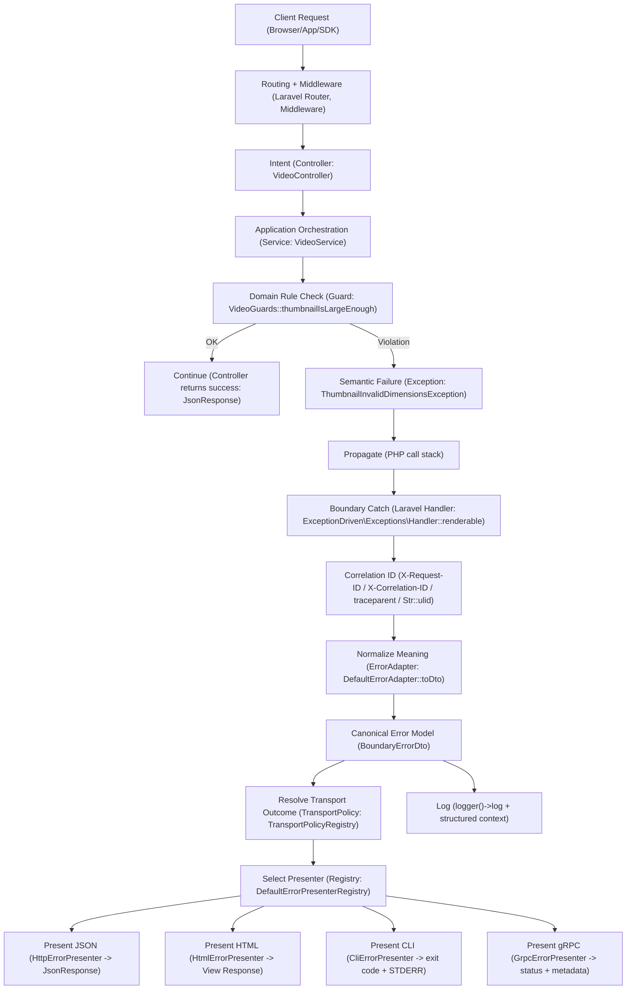

# Exception-Driven Error Handling in Laravel: one contract, one boundary

In growing Laravel teams, error handling drifts: some controllers return `success=false` with `200`, others throw exceptions, others mix status codes, payload shapes, logging and messages inline. The result is predictable: inconsistent API contracts, duplicated mappings, slow incident response (no universal correlation), and pain when adding new transports (CLI/HTML/gRPC).

The non‑negotiable goal is simple:

- one stable semantic contract (`response_code`)
- one boundary‑owned translation layer (policy + presentation)
- one universal model that works across transports (HTTP/CLI/gRPC)




In a medium/large Laravel codebase, error handling slowly becomes a mess.

- some controllers return `success=false` with `200`
- others throw exceptions
- others mix status codes, payload schema, logging rules and message text inline

The outcome is always the same: **unstable API contracts**, duplicated mappings, and incident response that takes hours because correlation is inconsistent.

The fix is simple:

**Use exceptions for meaning. Use the boundary for policy.**  
Clients rely on a stable `response_code`, not on message text.

---

## The rule that makes this scale

**Domain throws meaning. Boundary translates meaning.**

- The domain should express *what happened* (semantic exception).
- The boundary decides *how to represent it* (HTTP status, JSON schema, CLI exit code, gRPC status, translated message, logging).

This gives you one stable semantic contract and lets you add new transports without rewriting error logic.

---

## Before / After (real route)

### Before: meaning + policy mixed everywhere

```php
public function uploadThumbnail(Request $request): JsonResponse
{
    $width = (int) $request->input('width');
    $height = (int) $request->input('height');

    if ($width < 640 || $height < 360) {
        return response()->json([
            'success' => false,
            'error' => [
                'response_code' => 'THUMBNAIL_TOO_SMALL',
                'message' => 'Thumbnail too small',
                'meta' => ['width' => $width, 'height' => $height],
            ],
        ], 422);
    }

    return response()->json(['success' => true]);
}
```

This “works” until you have 20 controllers and each one invents a new payload shape.

### After: domain throws meaning, boundary translates

```php
public function uploadThumbnail(Request $request): JsonResponse
{
    $width = (int) $request->input('width');
    $height = (int) $request->input('height');

    VideoGuards::thumbnailIsLargeEnough($width, $height);

    return response()->json(['success' => true]);
}
```

Now the controller is only intent. No transport policy leaks.

---

## The three building blocks

### 1) Semantic exceptions (meaning)

A semantic exception maps to a stable code (your client contract):

- `VIDEO_THUMBNAIL_INVALID_DIMENSIONS`
- `USER_EMAIL_ALREADY_TAKEN`
- …

```php
interface ApiExceptionInterface extends Throwable
{
    public function responseCode(): string;      // stable business contract
    public function translationKey(): string;   // boundary i18n
    public function logLevel(): string;         // semantic severity hint
    public function publicMeta(): array;        // client-safe metadata
}
```

### 2) Boundary DTO + Adapter (normalize everything)

At the boundary, you convert any `Throwable` into one canonical model.

- If it’s semantic → preserve meaning.
- If it’s unknown → map to `INTERNAL_SERVER_ERROR` and enrich log context.

```php
final class BoundaryErrorDto
{
    public function __construct(
        public readonly string $responseCode,
        public readonly string $messageKey,
        public readonly string $logLevel,
        public readonly array $meta,
        public readonly array $logContext,
        public readonly string $correlationId,
    ) {}
}
```

### 3) Policy registry + Presenter (policy + output)

- Policy decides **HTTP status / CLI exit / gRPC status**.
- Presenter decides **payload format** (JSON/HTML/CLI/gRPC).
- Both operate only on the DTO (no domain logic inside).

This is the part that stops mapping rules from being duplicated across the codebase.

---

## Quick Start (10 minutes)

### Step 1: add a boundary renderable in Laravel’s handler

```php
public function register(): void
{
    $this->renderable(function (Throwable $e, $request) {
        $correlationId =
            $request?->headers->get('X-Request-ID')
            ?? $request?->headers->get('X-Correlation-ID')
            ?? $request?->headers->get('traceparent')
            ?? (string) Str::ulid();

        $dto = app(ErrorAdapterInterface::class)->toDto($e, $correlationId);

        logger()->log($dto->logLevel, $e->getMessage(), [
            'response_code' => $dto->responseCode,
            'correlation_id' => $dto->correlationId,
            'meta' => $dto->meta,
            'context' => $dto->logContext,
        ]);

        return app(ErrorPresenterRegistryInterface::class)
            ->resolveForHttp($request)
            ->present($dto);
    });
}
```

### Step 2: throw one semantic exception in one domain guard

```php
final class VideoGuards
{
    public static function thumbnailIsLargeEnough(int $w, int $h): void
    {
        if ($w < 640 || $h < 360) {
            throw new ThumbnailInvalidDimensionsException($w, $h);
        }
    }
}
```

### Step 3: map that `response_code` to outcomes in a provider

The mapping stays in the domain module (not in controllers, not in the exception class).

---

## Expected JSON (invalid thumbnail)

```json
{
  "success": false,
  "error": {
    "response_code": "VIDEO_THUMBNAIL_INVALID_DIMENSIONS",
    "log_level": "info",
    "message": "Thumbnail is too small",
    "meta": {"width": 320, "height": 240},
    "correlation_id": "01HF...ULID"
  }
}
```

Clients branch on `response_code`. Message text is boundary-owned and can change safely.

---

## Gotchas (the ones that matter)

- **Exceptions are not control flow.** If you can continue meaningfully, don’t throw.
- **Never catch without recovery.** Catch only to fallback or compensate.
- **Don’t test translated messages.** Test `response_code` + transport outcome.
- **Don’t leak internal details.** `meta` must be client-safe; stack traces stay in logs.

---

## Why this is worth it

With discipline, you get:

- one stable contract (`response_code`)
- one canonical DTO at the boundary
- modular policy (HTTP/CLI/gRPC) without a giant global mapping table
- consistent correlation IDs across logs and clients

Everything else (full interfaces, reference implementations, folder structure) belongs in the repo as documentation, not in a Medium post.
