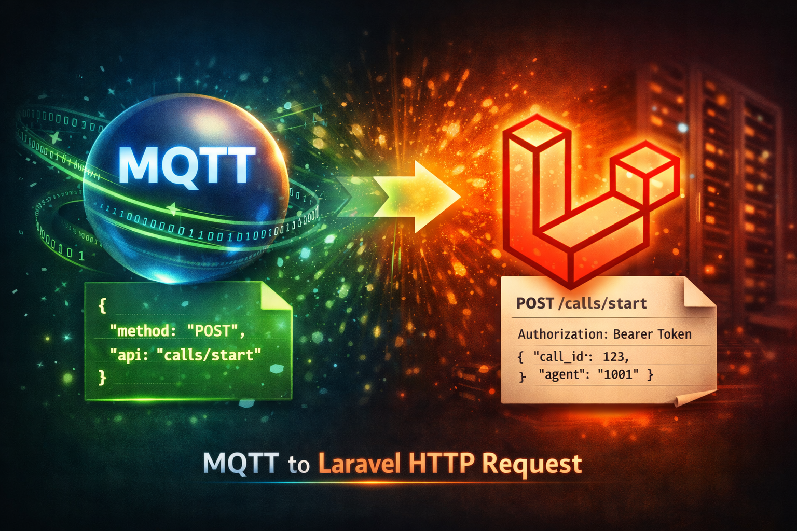
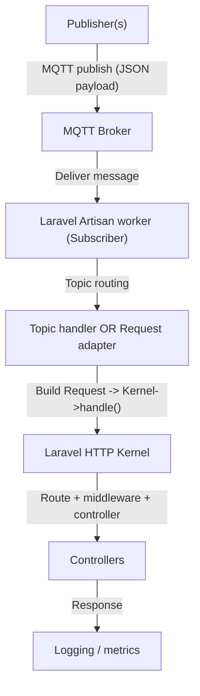
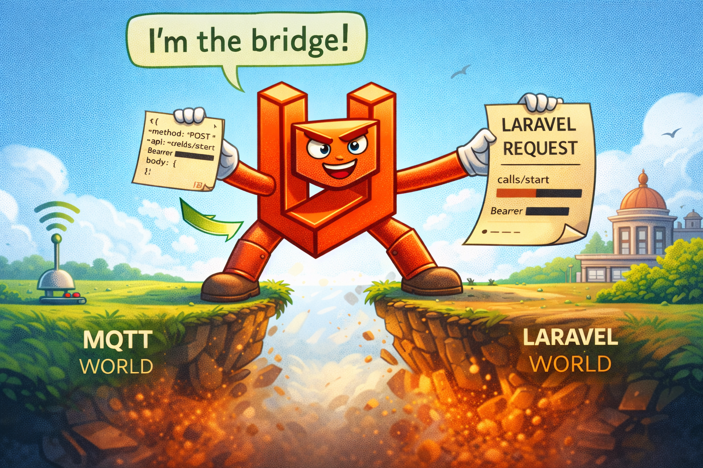

# From MQTT Broker to Laravel Controllers



## Turning MQTT messages into internal Laravel HTTP requests (pragmatic bridge)

Event-driven systems often need to trigger the **same** business logic from multiple entry points: HTTP, queues, WebSockets—or MQTT.

In this post, I’ll describe a pragmatic bridge: consume MQTT messages in a long-running Laravel worker, then adapt each message into an **internal Laravel request** handled by the HTTP Kernel and routed to controllers.

The approach is intentionally simple and production-oriented:

* **Subscriber worker**: stays connected to the broker, subscribes to topics, dispatches incoming messages.

This pattern shines when you have **external real-time producers** that speak sockets/WebSockets (a frontend socket gateway, AI agents connected via sockets, telephony/RTC edge services, etc.) and you want them to trigger the **same** Laravel HTTP pipeline without duplicating boundary logic.

* **Topic registry**: topics + handlers discovered from configuration.
* **Request adapter**: MQTT payload → internal HTTP request → Kernel → controllers/middleware.

This article is deliberately **adapter-first**: the subscriber and topic registry are supporting actors.

This approach assumes a **service-oriented architecture** where controllers are **thin** (boundary/orchestration) and the real business logic lives in services/use-cases. If your controllers are “fat”, this pattern will magnify that pain—exactly like it does for normal REST routes, but across more entry points. The interesting part is the protocol bridge:

**MQTT payload → PSR-7 request (PSR-17 factories) → HttpFoundation → Laravel Request → Kernel → Laravel Response → PSR-7 response**.

## Prerequisites & assumptions

* A Laravel app where the HTTP layer already enforces **auth**, **middleware**, **validation**, and **policies**.
* An MQTT client that supports a blocking loop (`loop(true)` / reactor style) and graceful interruption.
* The subscriber runs under a process manager (Supervisor, systemd, Kubernetes) because it is **long-running**.

---

## Big picture

### High-level flow



### Responsibilities

* **Subscriber process**: connectivity, subscriptions, dispatch.
* **Adapter layer**: protocol translation (MQTT message contract → HTTP execution model).

---

## Message contract

If you want MQTT to trigger the HTTP stack, the message must carry enough information to “look like” an HTTP call.

### Recommended payload (avoid double-encoded JSON)

**Don’t** send JSON as a string inside JSON. It’s fragile and painful to debug.

**Do** send a JSON object:

```json
{
  "method": "POST",
  "api": "calls/start",
  "jwtToken": "Bearer <redacted>",
  "body": {
    "call_id": 123,
    "agent": "1001"
  },
  "correlation_id": "1f5a1b22-2f0b-4c71-a3a6-0a9b0b2d58d1",
  "idempotency_key": "calls-start:123"
}
```

### Minimal schema (informal)

* `method` (required): `GET|POST|PUT|PATCH|DELETE`
* `api` (required): route-like path segment, e.g. `calls/start`
* `jwtToken` (optional): `Bearer ...` (see Security section)
* `body` (optional): object/array payload
* `correlation_id` (recommended): trace/log across systems
* `idempotency_key` (recommended): safe retries & de-dup

---

## The subscriber worker (context only)

The subscriber should stay boring:

* connect
* subscribe
* on message → call the adapter

Once the adapter produces a real HTTP-shaped request, Laravel can do the rest (middleware, auth, routing, controllers).

A minimal callback looks like this:

```php
$mqtt->subscribe('your/topic', function (string $topic, string $message) {
    $response = app(RequestAdapterService::class)->handleMqttMessage($message);
    app(AdapterLogger::class)->log($topic, $response);
});

$mqtt->loop(true);
```

### Optional: validate the MQTT envelope early

Adding a lightweight validation step in the subscriber is a good idea.

Keep it **minimal**: validate the **envelope** (method/api/jwtToken/correlation/idempotency) and basic types, **and validate `api` against an allowlist/mapping**. Then let your normal HTTP validation handle the business payload (`body`).

Why it helps:

* Fail fast on malformed messages (before touching the Kernel).
* Protect the adapter from garbage inputs.
* Better logs (you can log a clear validation error + correlation_id).

Why not overdo it:

* You’ll duplicate validation rules already enforced by HTTP FormRequests.
* You risk drift (schema says one thing, controllers validate another).

If you adopt JSON Schema, treat it as **transport-contract validation**, not domain validation.

Ultra-short JSON Schema example (envelope only):

```json
{
  "$schema": "https://json-schema.org/draft/2020-12/schema",
  "type": "object",
  "required": ["method", "api"],
  "additionalProperties": true,
  "properties": {
    "method": {"type": "string", "enum": ["GET","POST","PUT","PATCH","DELETE"]},
    "api": {"type": "string", "minLength": 1},
    "jwtToken": {"type": "string"},
    "body": {"type": ["object","array","null"]},
    "correlation_id": {"type": "string", "format": "uuid"},
    "idempotency_key": {"type": "string", "minLength": 1},
    "query": {"type": "object", "additionalProperties": {"type": ["string","number","boolean","null"]}}
  }
}
```

If you want a topic registry and multiple handlers, keep it—but treat it as plumbing (I put an optional example in the Appendix).

---

## Topic routing (optional)

Topic routing is useful, but it’s not the core of this post.

A good split is:

* **Event-shaped topics** → dedicated handlers (`handle($topic, $message)`).
* **HTTP-shaped topics** → go through the adapter (reuse middleware/controllers).

---

## The PSR adapter (MQTT message → PSR-7/PSR-17 → internal Laravel request)



This is the core: instead of re-implementing auth/validation/policies for MQTT, we adapt the message into an HTTP request *shape* and let Laravel execute the usual HTTP Kernel pipeline.

### PSR-7 and PSR-17 (not PSR-13)

If you were thinking “PSR-13”, that’s almost certainly a mix-up.

* **PSR-7** defines HTTP request/response message interfaces.
* **PSR-17** defines factories to create PSR-7 messages/streams.

Laravel itself uses Symfony HttpFoundation internally, so PSR is a clean intermediate representation.

### The conversion pipeline

1. Decode the MQTT JSON payload.
2. Build a **PSR-7 request**:

   * method + internal path
   * headers (Authorization, correlation, idempotency)
   * JSON body as a stream
3. Convert PSR-7 → **Symfony HttpFoundation** request.
4. Convert HttpFoundation → **Laravel Request**.
5. Run HTTP Kernel:

   * `$kernel->handle($request)`
   * `$kernel->terminate($request, $response)`
6. Convert Laravel/Symfony response → **PSR-7 response** (optional, but great for interop/logging).

### Code excerpt (adapter service)

Key detail: we inject the JSON as **raw request body** (PSR-7 stream) and set `Content-Type: application/json`. This keeps behavior consistent with a real HTTP JSON call (so `$request->json()` works as expected).

```php
<?php

declare(strict_types=1);

use GuzzleHttp\Psr7\HttpFactory;
use GuzzleHttp\Psr7\ServerRequest;
use GuzzleHttp\Psr7\Utils;
use Illuminate\Contracts\Http\Kernel;
use Illuminate\Http\Request as LaravelRequest;
use Psr\Http\Message\ResponseInterface;
use Symfony\Bridge\PsrHttpMessage\Factory\HttpFoundationFactory;
use Symfony\Bridge\PsrHttpMessage\Factory\PsrHttpFactory;

final class RequestAdapterService
{
    /**
     * Internal entrypoint used by the adapter.
     * Keep it explicit and ensure only allowlisted actions/routes
     * can be reached.
     */
    private const SUBSCRIBE_PREFIX = '/subscribe/';

    private PsrHttpFactory $psrHttpFactory;
    private HttpFoundationFactory $httpFoundationFactory;

    /**
     * Build the adapter around Laravel's HTTP Kernel.
     *
     * The Kernel is the single entrypoint for the HTTP lifecycle 
     * (middleware, routing, controllers).
     * PSR-17 factories are initialized once to avoid re-allocations
     * per message in a long-running process.
     *
     * @param Kernel $kernel Laravel HTTP Kernel.
     */
    public function __construct(private readonly Kernel $kernel)
    {
        $psr17 = new HttpFactory();

        // PSR-17 factories are used by the Symfony PSR bridge.
        $this->psrHttpFactory = new PsrHttpFactory($psr17, $psr17, $psr17, $psr17);
        $this->httpFoundationFactory = new HttpFoundationFactory();
    }

    /**
     * Handle a single MQTT message by translating it into an internal
     * HTTP request.
     *
     * Pipeline:
     * - MQTT JSON envelope -> PSR-7 request
     * - PSR-7 -> Symfony HttpFoundation -> Laravel Request
     * - Kernel handle/terminate
     * - Laravel/Symfony response -> PSR-7 response
     *
     * @param string $message Raw MQTT payload (JSON).
     * @return ResponseInterface PSR-7 produced by the Laravel HTTP pipeline.
     * @throws \JsonException When the MQTT payload is not valid JSON.
     */
    public function handleMqttMessage(string $message): ResponseInterface
    {
        /** @var array<string, mixed> $payload */
        $payload = json_decode($message, true, 512, JSON_THROW_ON_ERROR);

        $psrRequest = $this->payloadToPsrRequest($payload);

        // PSR-7 -> Symfony -> Laravel
        $symfonyRequest = $this->httpFoundationFactory->createRequest($psrRequest);
        $laravelRequest = LaravelRequest::createFromBase($symfonyRequest);

        $response = $this->kernel->handle($laravelRequest);
        $this->kernel->terminate($laravelRequest, $response);

        // Laravel/Symfony response -> PSR-7
        return $this->psrHttpFactory->createResponse($response);
    }

    /**
     * Convert the MQTT envelope into a PSR-7 ServerRequest.
     * Notes:
     * - `api` must be an allowlisted action key (or mapped) to avoid 
     *   arbitrary internal path invocation.
     * - JSON body is injected as the raw request stream to match real 
     *   HTTP JSON behavior.
     *
     * @param array<string, mixed> $payload Decoded MQTT JSON envelope.
     * @return ServerRequest PSR-7 request representing the internal call.
     * @throws \JsonException When encoding the JSON body fails.
     */
    private function payloadToPsrRequest(array $payload): ServerRequest
    {
        $method = (string) ($payload['method'] ?? 'POST');
        $api = ltrim((string) ($payload['api'] ?? ''), '/');

        // IMPORTANT: treat `api` as a whitelisted action key (or map it) 
        //  rather than an arbitrary path.
        $path = self::SUBSCRIBE_PREFIX . $api;

        $headers = [
            'Accept' => 'application/json',
            'Content-Type' => 'application/json',
        ];

        if (!empty($payload['jwtToken'])) {
            $headers['Authorization'] = (string) $payload['jwtToken'];
        }
        if (!empty($payload['correlation_id'])) {
            $headers['X-Correlation-Id'] = (string) $payload['correlation_id'];
        }
        if (!empty($payload['idempotency_key'])) {
            $headers['Idempotency-Key'] = (string) $payload['idempotency_key'];
        }

        $body = is_array($payload['body'] ?? null) ? $payload['body'] : [];
        $json = json_encode(
            $body,
            JSON_UNESCAPED_SLASHES | JSON_UNESCAPED_UNICODE | JSON_THROW_ON_ERROR
        );

        return new ServerRequest($method, $path, $headers, Utils::streamFor($json));
    }
}

```

### Facade vs service

If you like the static call style, expose `RequestAdapterService` via a Laravel Facade. If you want to keep it explicit and honest in the article (and in code), prefer DI:

```php
$response = app(RequestAdapterService::class)->handleMqttMessage($message);
```

### Practical extras (keep it minimal)

These are small touches that make the adapter feel production-grade without bloating the design:

* **Query string & route params**: if your payload includes `query`, append it to the internal path (and keep it whitelisted).
* **Correlation + idempotency**: propagate them as headers (already shown) and make your logger always print them.
* **Scheme/host**: only set them if some middleware depends on them; otherwise keep the request “internal” to avoid surprises.

Example for query support:

```php
private const SUBSCRIBE_PREFIX = '/subscribe/';

// ...

$path = self::SUBSCRIBE_PREFIX . $api;

if (!empty($payload['query']) && is_array($payload['query'])) {
    $qs = http_build_query($payload['query']);
    if ($qs !== '') {
        $path .= '?' . $qs;
    }
}
```

---

## Why not call services directly?

You *can* and sometimes you *should*.

### Why this pattern exists

* You already have **auth**, **policies**, **validation**, **rate limiting**, **tenancy**, etc. in HTTP middleware.
* You want consistent behavior regardless of entry point.
* You want to avoid duplicating boundary logic.

### The cost (be honest)

* **Tighter coupling**: the publisher contract starts to mirror internal routes.

  * Yes, you can reduce this by keeping a stable internal ingress (e.g. `/subscribe/*` routes in one file) and mapping internally.
  * But the publisher is still coupled to *something* stable: `api` values, allowed methods, required headers, and the envelope structure.
* **Controller anti-pattern risk**: if controllers contain business logic, you’ve just amplified the mess.

### Rule of thumb

* Keep controllers thin (are you doing different?).
* Put business logic in services/use-cases.
* Treat the adapter as a **boundary bridge**, not as your architecture foundation.

---

## Sharp edges in long-running Laravel processes

This is where people get burned.

### Container & request state

A long-running worker can accidentally retain:

* resolved singletons
* caches in memory
* auth context
* request-scoped state that isn’t truly request-scoped

Mitigations (choose what fits your stack):

* keep the adapter/service stateless
* avoid static caches tied to a single request
* reset/flush what you explicitly control between messages
* monitor memory growth and restart workers proactively (process manager policies)

### Timeouts & backpressure

If the worker blocks inside Kernel handling, you can stall consumption. Consider:

* per-message timeout
* circuit breaker behavior
* pushing heavy work into queues/jobs

---

## Operational considerations

### QoS level

If you use `QoS 0 (at most once)`:

* ✅ minimal overhead, low latency
* ❗ messages can be lost

Practical implication: the system must tolerate loss, or you must move up in reliability:

* higher QoS
* or application-level ack/retry semantics (e.g., publish an ack topic)

### Idempotency

If publishers retry (or the broker redelivers), you will see duplicates.

Make the handler/controller idempotent using:

* `idempotency_key` (recommended)
* request de-dup store (Redis) if needed

### Correlation ID

Always propagate `correlation_id` into:

* request headers
* logs
* metrics/tracing

It’s the difference between debugging in minutes vs hours.

---

## Security notes (do not hand-wave this)

If you carry `jwtToken` in MQTT messages:

* Use **TLS** for MQTT.
* Use broker-side **ACLs** (who can publish/subscribe to what).
* Keep JWT short-lived (`exp`), validate `aud`/`iss`, and prefer least privilege.

To reduce replay risks:

* include `timestamp`
* reject messages older than a window
* use `idempotency_key` or nonce semantics where needed

If you can avoid shipping JWT from publishers, consider:

* broker identity → map to internal principal
* signed payloads with a shared key per publisher (rotated)

---

## Design patterns cheat sheet (as applied here)

* **Command**: subscriber is an Artisan command encapsulating a long-running process.
* **Observer / Pub-Sub**: MQTT is pub-sub; callbacks observe events.
* **Reactor / Event loop**: `$mqtt->loop(true)` dispatches registered callbacks.
* **Registry/Plugin**: topics discovered from configuration.
* **Strategy / Command objects**: each topic handler provides `handle()`.
* **Facade (Laravel)**: you can expose `RequestAdapterService` with a Facade if you really want static calls (optional).
* **Adapter / Anti-Corruption Layer**: MQTT payload → internal Laravel request.

---

## Alternatives (when this is the wrong tool)

Depending on your constraints, consider:

1. **Call services/use-cases directly** (cleanest, least coupling).
2. **Dispatch a queued Job** (better isolation, retries, backpressure).
3. **Internal command bus** (strong decoupling, still consistent validation at the boundary).

---

## Conclusion

This pattern is a practical bridge between an event-driven world (MQTT topics and messages) and an HTTP-centric Laravel application (controllers, middleware, request lifecycle).

Keep the subscriber focused on connectivity + dispatch. Keep the adapter focused on translation. And be explicit about the tradeoffs: coupling, long-running process pitfalls, idempotency, and security.

---

## Appendix: the two key code hotspots

* Subscriber callback path: `Modules/System/Console/Subscriber.php`
* Adapter path: the request adapter class (MQTT payload → internal Laravel request)
